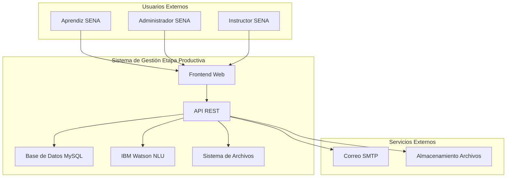
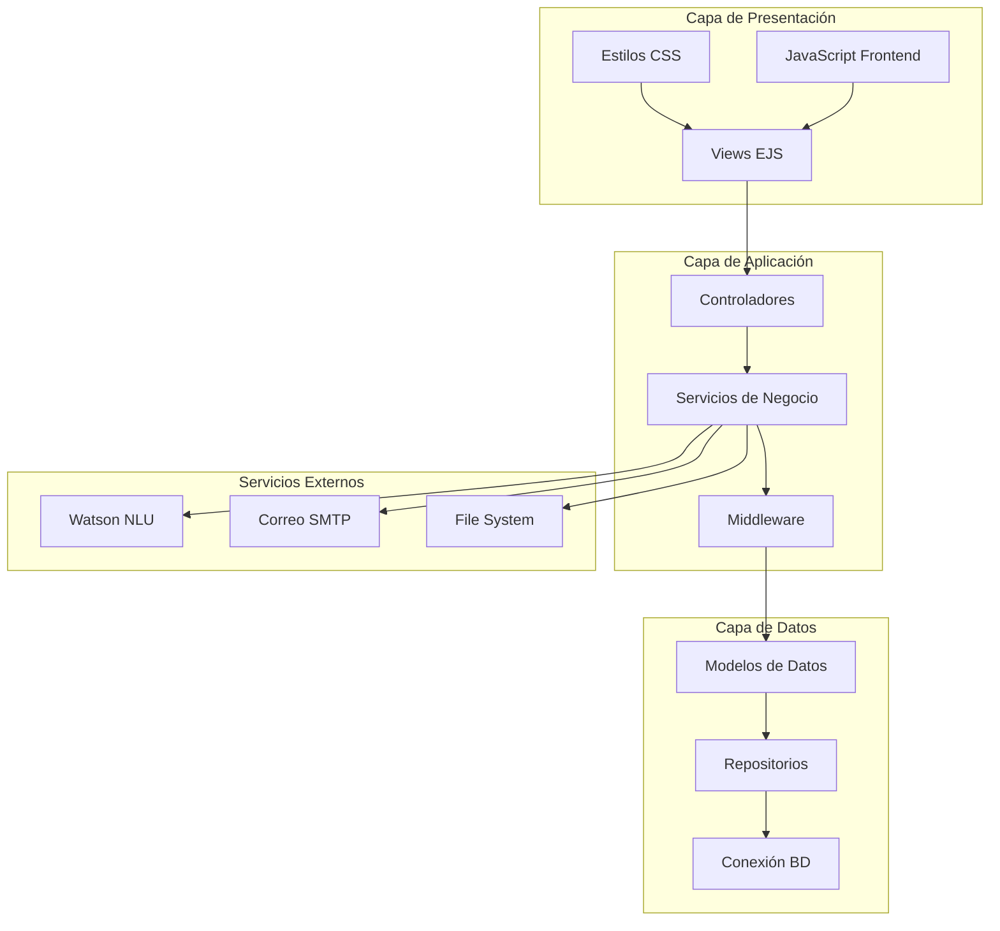

# Documentación Técnica Completa - Gestión Etapa Productiva SENA

## 📋 Información General

**Nombre del Proyecto:** Gestión Etapa Productiva SENA
**Versión:** 1.0.0
**Fecha:** Diciembre 2024
**Autor:** Juan Camilo Pareja Sánchez
**Institución:** Servicio Nacional de Aprendizaje (SENA)
**Tecnologías:** Node.js, Express.js, MySQL, EJS, IBM Watson

## 🏗️ Arquitectura del Sistema

### Arquitectura General (C4 - Context)



### Arquitectura de Componentes (C4 - Components)



## 📁 Estructura del Proyecto

```
gestion-etapa-productiva/
├── 📂 public/                          # Archivos estáticos
│   ├── 📂 estilos/                     # Sistema de estilos modular
│   │   ├── 📂 base/                    # Estilos base (reset, typography, layout)
│   │   ├── 📂 components/              # Componentes reutilizables
│   │   ├── 📂 themes/                  # Temas (SENA theme)
│   │   ├── 📂 utilities/               # Utilidades (animations, accessibility)
│   │   └── 📄 main.css                 # Archivo principal de estilos
│   ├── 📂 js/                          # JavaScript del frontend
│   ├── 📂 uploads/                     # Archivos subidos
│   └── 📂 imagenes/                    # Imágenes y logos
├── 📂 src/                             # Código fuente
│   ├── 📂 configuracion/               # Configuraciones del sistema
│   │   ├── 📄 baseDatos.js             # Conexión MySQL
│   │   ├── 📄 watsonConfig.js          # Configuración Watson
│   │   ├── 📄 seguridad.js             # Configuración de seguridad
│   │   ├── 📄 optimizacionBD.js        # Optimización BD
│   │   └── 📄 monitoreo.js             # Sistema de monitoreo
│   ├── 📂 modulos/                     # Módulos de negocio
│   │   ├── 📂 administrador/           # Módulo administrador
│   │   ├── 📂 aprendiz/                # Módulo aprendiz
│   │   └── 📂 compartido/              # Funcionalidades compartidas
│   ├── 📂 compartido/                  # Código compartido
│   │   ├── 📂 middlewares/             # Middlewares personalizados
│   │   ├── 📂 servicios/               # Servicios compartidos
│   │   ├── 📂 utilidades/              # Utilidades generales
│   │   └── 📂 utilidades/logger.js     # Sistema de logging
│   ├── 📂 validaciones/                # Validaciones de entrada
│   └── 📄 servidor.js                  # Punto de entrada
├── 📂 tests/                           # Tests automatizados
├── 📂 views/                           # Plantillas EJS
├── 📂 data/                            # Datos estáticos
├── 📂 scripts/                         # Scripts de utilidad
├── 📂 logs/                            # Logs de aplicación
└── 📂 node_modules/                    # Dependencias
```

## 🔧 Tecnologías y Dependencias

### Tecnologías Principales
- **Node.js 18+**: Runtime de JavaScript
- **Express.js 4.18**: Framework web
- **MySQL 8.0**: Base de datos relacional
- **EJS 3.1**: Motor de plantillas
- **IBM Watson NLU**: Análisis de sentimientos

### Dependencias de Producción
```json
{
  "express": "^4.18.2",
  "mysql2": "^3.6.5",
  "ejs": "^3.1.9",
  "express-ejs-layouts": "^2.5.1",
  "bcrypt": "^6.0.0",
  "express-session": "^1.17.3",
  "multer": "^1.4.5-lts.1",
  "ibm-watson": "^8.0.0",
  "nodemailer": "^6.9.7",
  "helmet": "^8.1.0",
  "compression": "^1.8.0",
  "cors": "^2.8.5"
}
```

### Dependencias de Desarrollo
```json
{
  "jest": "^29.7.0",
  "supertest": "^6.3.3",
  "nodemon": "^3.0.2",
  "@types/node": "^24.0.13"
}
```

## 🗄️ Modelo de Datos

### Diagrama Entidad-Relación

```mermaid
erDiagram
    aprendices ||--o{ bitacoras : registra
    aprendices ||--o{ documentos_aprendiz : sube
    administradores ||--o{ aprendices : gestiona
    aprendices {
        int id PK
        varchar tipoDocumento
        varchar numeroDocumento UK
        varchar estadoFormacion
        varchar nombres
        varchar primerApellido
        varchar segundoApellido
        date fechaNacimiento
        varchar eps
        varchar telefonoFijo
        varchar celular
        varchar direccion
        varchar barrio
        varchar departamento
        varchar municipio
        varchar correoElectronico UK
        date fechaInicioFormacion
        date fechaInicioLectiva
        date fechaFinLectiva
        date fechaInicioProductiva
        date fechaFinProductiva
        varchar instructorLectiva
        varchar instructorProductiva
        varchar numeroFicha
        varchar programaFormacion
        varchar alternativaSeleccionada
        varchar areaFormacion
        varchar empresaPatrocinadora
        varchar areaPractica
        varchar jefeInmediato
        varchar telefonoEmpresa
        varchar celularEmpresa
        varchar direccionEmpresa
        varchar correoEmpresa
        varchar horario
        varchar password
        varchar rol
        tinyint activo
        datetime fechaRegistro
        datetime fechaUltimoCorreoAlerta
    }
    bitacoras {
        int id PK
        int aprendizId FK
        datetime fechaRegistro
        text contenido
        varchar estado
        datetime fechaAprobacion
        text comentariosInstructor
        text sentimiento_desafio
        text sentimiento_logro
        text sentimiento_comunicacion
        decimal score_desafio
        decimal score_logro
        decimal score_comunicacion
        text sentimiento_general
        decimal score_promedio
        decimal confianza
        boolean contiene_ironia
        json contextos_detectados
        json recomendaciones
        datetime created_at
        datetime updated_at
    }
    documentos_aprendiz {
        int id PK
        int aprendiz_id FK
        varchar tipo_documento
        varchar descripcion
        varchar nombre_original
        varchar nombre_guardado
        datetime fecha_subida
        bigint tamano_bytes
        varchar tipo_mime
        tinyint activo
        datetime created_at
    }
    administradores {
        int id PK
        varchar nombreCompleto
        varchar correoInstitucional UK
        varchar numeroIdentificacion UK
        varchar telefono
        varchar departamento
        varchar cargo
        varchar password
        varchar rol
        tinyint activo
        datetime fechaRegistro
    }
```



### Índices Optimizados

```sql
-- Índices para búsquedas frecuentes
CREATE INDEX idx_aprendices_correo ON aprendices(correoElectronico);
CREATE INDEX idx_aprendices_documento ON aprendices(tipoDocumento, numeroDocumento);
CREATE INDEX idx_aprendices_programa ON aprendices(programaFormacion);
CREATE INDEX idx_aprendices_alternativa ON aprendices(alternativaSeleccionada);
CREATE INDEX idx_aprendices_estado ON aprendices(estadoFormacion);

-- Índices para bitácoras
CREATE INDEX idx_bitacoras_aprendiz ON bitacoras(aprendizId);
CREATE INDEX idx_bitacoras_fecha ON bitacoras(fechaRegistro);
CREATE INDEX idx_bitacoras_estado ON bitacoras(estado);

-- Índices para documentos
CREATE INDEX idx_documentos_aprendiz ON documentos_aprendiz(aprendiz_id);

-- Índices para administradores
CREATE INDEX idx_administradores_correo ON administradores(correoInstitucional);
```

## 🔐 Seguridad

### Medidas Implementadas

#### Autenticación y Autorización
- **Hashing de contraseñas**: bcrypt con salt rounds = 10
- **Sesiones seguras**: express-session con MySQL store
- **Validación de roles**: Middleware de autorización por rol
- **Timeouts de sesión**: Configurable por entorno

#### Validación de Entrada
- **express-validator**: Validación server-side completa
- **Sanitización**: Eliminación de caracteres peligrosos
- **Límites de tamaño**: Control de longitud de inputs
- **Validación de tipos MIME**: Para archivos subidos

#### Headers de Seguridad
- **Helmet.js**: Configuración completa de headers de seguridad
- **CORS**: Configuración restrictiva de orígenes permitidos
- **HSTS**: HTTP Strict Transport Security
- **CSP**: Content Security Policy

#### Protección contra Ataques Comunes
- **Rate Limiting**: express-rate-limit por rutas
- **SQL Injection**: Prepared statements con mysql2
- **XSS**: Sanitización y CSP
- **CSRF**: Tokens de validación (preparado para implementación)

### Configuración de Seguridad

```javascript
// src/configuracion/seguridad.js
const helmetConfig = {
    contentSecurityPolicy: {
        directives: {
            defaultSrc: ["'self'"],
            styleSrc: ["'self'", "'unsafe-inline'", "https://fonts.googleapis.com"],
            scriptSrc: ["'self'", "'unsafe-inline'", "https://code.jquery.com"],
            imgSrc: ["'self'", "data:", "https:"],
            connectSrc: ["'self'", "https://api.watson.cloud.ibm.com"],
            objectSrc: ["'none'"],
            upgradeInsecureRequests: [],
        },
    },
    hsts: { maxAge: 31536000, includeSubDomains: true, preload: true },
    noSniff: true,
    xssFilter: true,
    referrerPolicy: { policy: "strict-origin-when-cross-origin" },
    frameguard: { action: 'deny' }
};
```

## 🚀 API REST

### Endpoints Principales

#### Autenticación
```
POST   /auth/login              - Inicio de sesión
POST   /auth/logout             - Cierre de sesión
POST   /auth/reset-password     - Reset de contraseña
POST   /crear-password          - Creación de contraseña inicial
```

#### Administrador
```
GET    /administrador/dashboard - Panel principal
GET    /administrador/aprendices - Listado de aprendices
POST   /administrador/aprendices - Crear aprendiz
PUT    /administrador/aprendices/:id - Actualizar aprendiz
DELETE /administrador/aprendices/:id - Eliminar aprendiz
GET    /administrador/bitacoras/:id - Ver bitácoras de aprendiz
GET    /administrador/reportes   - Reportes y estadísticas
```

#### Aprendiz
```
GET    /aprendiz/dashboard      - Dashboard del aprendiz
POST   /aprendiz/bitacora       - Registrar bitácora
GET    /aprendiz/documentos     - Gestionar documentos
POST   /aprendiz/documentos     - Subir documento
```

### Formatos de Respuesta

#### Respuesta Exitosa
```json
{
  "success": true,
  "data": { ... },
  "message": "Operación exitosa"
}
```

#### Respuesta de Error
```json
{
  "success": false,
  "error": "Descripción del error",
  "details": [ ... ]
}
```

#### Respuesta de Datos Tabulares (DataTables)
```json
{
  "draw": 1,
  "recordsTotal": 100,
  "recordsFiltered": 50,
  "data": [ ... ]
}
```

## 📊 Monitoreo y Métricas

### Métricas Recopiladas

#### Rendimiento de Aplicación
- **Requests totales**: Contador de requests HTTP
- **Tiempo de respuesta**: Promedio y percentiles
- **Tasa de error**: Porcentaje de responses 4xx/5xx
- **Uso de memoria**: Heap usage y picos
- **Uso de CPU**: Load average del sistema

#### Base de Datos
- **Conexiones activas**: Número de conexiones abiertas
- **Consultas ejecutadas**: Contador total
- **Consultas lentas**: Queries > 1 segundo
- **Tiempo promedio de consultas**: En milisegundos

#### Sistema
- **Uptime**: Tiempo de ejecución
- **Memoria libre**: RAM disponible
- **CPU usage**: Porcentaje de uso

### Endpoints de Monitoreo

```
GET    /health     - Health check básico
GET    /metrics    - Métricas detalladas (requiere auth)
```

### Alertas Automáticas

- **Memoria alta**: > 500MB heap usage
- **CPU alta**: Load average > 2.0
- **Tasa de error**: > 5% de requests
- **Conexiones BD**: > 20 conexiones activas
- **Memoria sistema**: < 100MB libre

## 🧪 Testing

### Estrategia de Testing

#### Unit Tests
- **Cobertura**: Mínimo 80% de líneas
- **Herramientas**: Jest + Supertest
- **Mocks**: Base de datos y servicios externos

#### Integration Tests
- **API endpoints**: Validación completa de flujos
- **Base de datos**: Operaciones CRUD
- **Autenticación**: Flujos completos de login/logout

#### E2E Tests (Futuro)
- **User journeys**: Flujos completos de usuario
- **Performance**: Tests de carga

### Ejecución de Tests

```bash
# Tests unitarios
npm test

# Tests con cobertura
npm run test:coverage

# Tests de integración
npm run test:integration

# Tests de performance
npm run test:performance
```

### Estructura de Tests

```
tests/
├── unit/
│   ├── servicios/
│   ├── utilidades/
│   └── validaciones/
├── integration/
│   ├── api/
│   └── database/
├── e2e/
│   ├── user-journeys/
│   └── performance/
└── setup.js
```

## 🔧 Despliegue y DevOps

### Variables de Entorno

```bash
# Base de datos
DB_HOST=localhost
DB_PORT=3306
DB_USER=gestion_user
DB_PASSWORD=secure_password
DB_NAME=gestion_etapa_productiva

# Sesiones
SESSION_SECRET=very_secure_random_string
SESSION_NAME=gestion_session

# Watson NLU
WATSON_API_KEY=your_watson_api_key
WATSON_URL=https://api.us-south.natural-language-understanding.watson.cloud.ibm.com
WATSON_VERSION=2021-08-01

# Correo
SMTP_HOST=smtp.gmail.com
SMTP_PORT=587
SMTP_USER=your_email@gmail.com
SMTP_PASS=your_app_password

# Seguridad
NODE_ENV=production
JWT_SECRET=another_secure_random_string
RATE_LIMIT_WINDOW=900000
RATE_LIMIT_MAX=100

# Monitoreo
LOG_LEVEL=info
METRICS_ENABLED=true
```

### Docker Compose

```yaml
version: '3.8'
services:
  app:
    build: .
    ports:
      - "3000:3000"
    environment:
      - NODE_ENV=production
    depends_on:
      - mysql
      - redis
    volumes:
      - ./logs:/app/logs
      - ./uploads:/app/public/uploads

  mysql:
    image: mysql:8.0
    environment:
      MYSQL_ROOT_PASSWORD: rootpassword
      MYSQL_DATABASE: gestion_etapa_productiva
      MYSQL_USER: gestion_user
      MYSQL_PASSWORD: secure_password
    volumes:
      - mysql_data:/var/lib/mysql
      - ./MySQL.sql:/docker-entrypoint-initdb.d/init.sql

  redis:
    image: redis:7-alpine
    volumes:
      - redis_data:/data

volumes:
  mysql_data:
  redis_data:
```

### CI/CD Pipeline

```yaml
# .github/workflows/deploy.yml
name: Deploy to Production

on:
  push:
    branches: [ main ]

jobs:
  test:
    runs-on: ubuntu-latest
    steps:
      - uses: actions/checkout@v3
      - uses: actions/setup-node@v3
        with:
          node-version: '18'
      - run: npm ci
      - run: npm test
      - run: npm run test:security

  build-and-deploy:
    needs: test
    runs-on: ubuntu-latest
    steps:
      - uses: actions/checkout@v3
      - name: Build and push Docker image
        run: |
          docker build -t gestion-sena:latest .
          docker tag gestion-sena:latest ghcr.io/${{ github.repository }}/gestion-sena:latest
          docker push ghcr.io/${{ github.repository }}/gestion-sena:latest
```

## 📈 Optimización y Rendimiento

### Optimizaciones Implementadas

#### Base de Datos
- **Connection pooling**: mysql2 con pool de conexiones
- **Prepared statements**: Prevención de SQL injection
- **Índices optimizados**: Para consultas frecuentes
- **Query caching**: Cache inteligente de resultados

#### Aplicación
- **Compression**: gzip para responses
- **Caching**: Headers de cache apropiados
- **Lazy loading**: Para recursos pesados
- **Minificación**: CSS y JS en producción

#### Frontend
- **Asset optimization**: Compresión y minificación
- **Critical CSS**: CSS crítico inline
- **Image optimization**: WebP y lazy loading
- **Bundle splitting**: Code splitting con webpack

### Benchmarks de Rendimiento

#### Tiempos de Respuesta (P95)
- **Dashboard**: < 500ms
- **Listado de aprendices**: < 800ms
- **Registro de bitácora**: < 300ms
- **Análisis Watson**: < 2000ms

#### Throughput
- **Requests/segundo**: 50-100 (dependiendo de la operación)
- **Conexiones concurrentes**: 100+
- **Memoria por request**: ~2-5MB

## 🔍 Troubleshooting

### Problemas Comunes y Soluciones

#### Error de Conexión a BD
```bash
# Verificar variables de entorno
echo $DB_HOST $DB_PORT $DB_USER

# Probar conexión manual
mysql -h $DB_HOST -P $DB_PORT -u $DB_USER -p

# Verificar logs
tail -f logs/error.log
```

#### Watson NLU no responde
```bash
# Verificar configuración
curl -X GET "$WATSON_URL/v1/analyze?version=$WATSON_VERSION&text=test" \
  -H "Authorization: Bearer $WATSON_API_KEY"

# Verificar logs de Watson
grep "Watson" logs/combined.log
```

#### Memoria Insuficiente
```bash
# Monitorear uso de memoria
node --max-old-space-size=1024 server.js

# Verificar métricas
curl http://localhost:3000/metrics

# Ajustar límites de PM2
pm2 reload ecosystem.config.js
```

#### Alta Latencia
```bash
# Verificar consultas lentas
mysql -e "SELECT * FROM performance_schema.events_statements_summary_by_digest WHERE avg_timer_wait > 1000000000 ORDER BY avg_timer_wait DESC LIMIT 10;"

# Revisar índices
mysql -e "SHOW INDEX FROM aprendices;"

# Verificar logs de aplicación
grep "lento\|slow" logs/combined.log
```

## 🚀 Roadmap y Mejoras Futuras

### Fase 1 (Q1 2025): Optimización
- [ ] Implementar Redis para caching
- [ ] Migrar a TypeScript
- [ ] Agregar tests E2E con Playwright
- [ ] Implementar API versioning

### Fase 2 (Q2 2025): Escalabilidad
- [ ] Arquitectura de microservicios
- [ ] Container orchestration con Kubernetes
- [ ] CDN para assets estáticos
- [ ] Database sharding

### Fase 3 (Q3 2025): IA y Analytics
- [ ] Dashboard avanzado con Power BI
- [ ] Recomendaciones automáticas con ML
- [ ] Análisis predictivo de deserción
- [ ] Chatbot de soporte

### Fase 4 (Q4 2025): Modernización
- [ ] Migración a React/Vue.js
- [ ] API GraphQL
- [ ] Serverless functions
- [ ] PWA (Progressive Web App)

## 📞 Soporte y Contacto

### Equipo de Desarrollo
- **Líder Técnico**: Juan Camilo Pareja Sánchez
- **Email**: juan.pareja@sena.edu.co
- **Repositorio**: https://github.com/juanpareja/gestion-etapa-productiva

### Documentación Adicional
- [Manual de Usuario](./Manual%20de%20usuario.pdf)
- [Documentación Técnica](./Documentacion%20Tecnica.pdf)
- [Guía de Instalación](./README.md)

### Canales de Soporte
- **Issues**: GitHub Issues
- **Wiki**: Documentación interna
- **Slack**: Canal #gestion-etapa-productiva

---

**Última actualización**: Diciembre 2024
**Versión de documentación**: 1.0.0