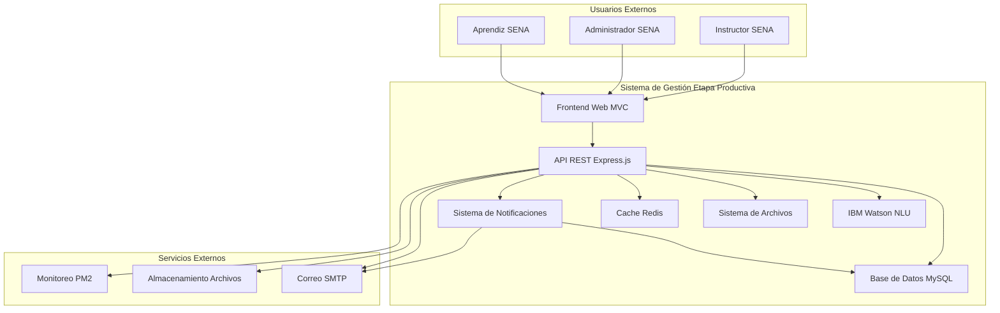
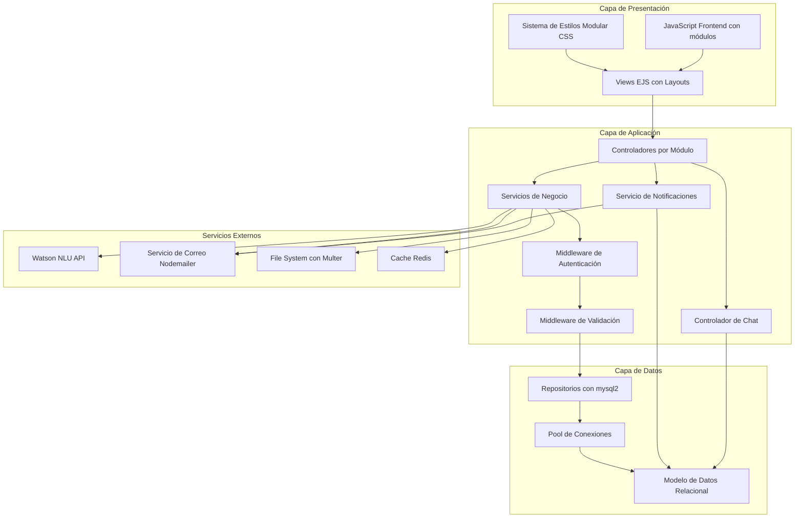
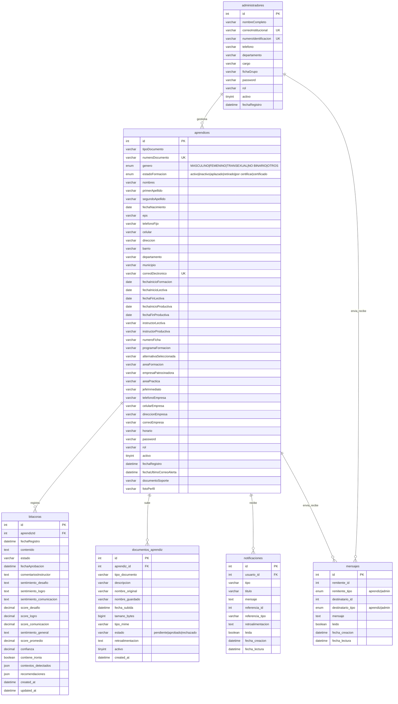
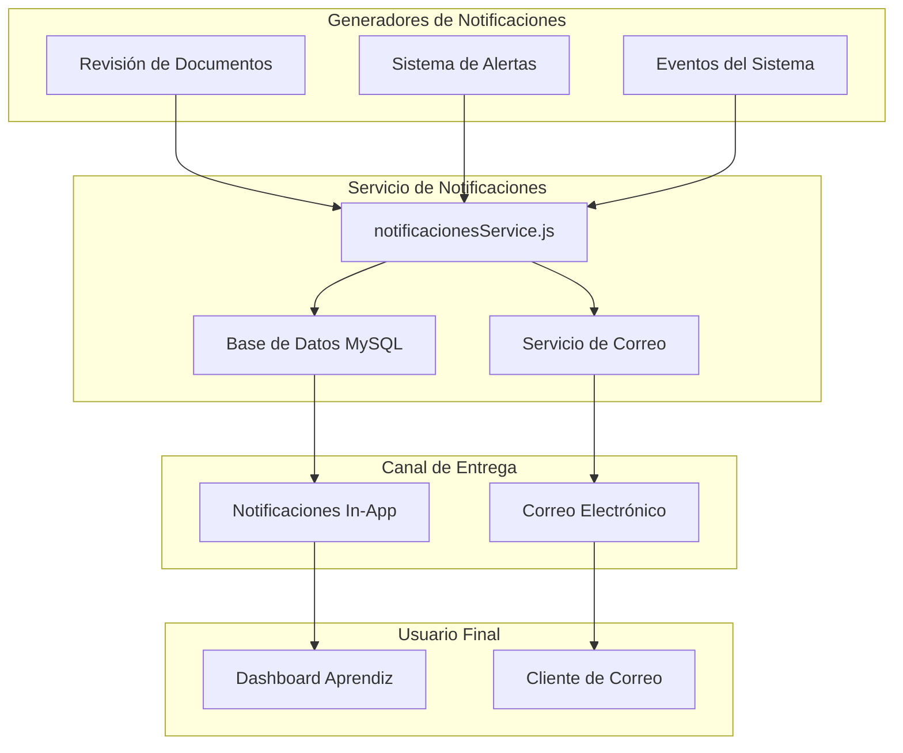
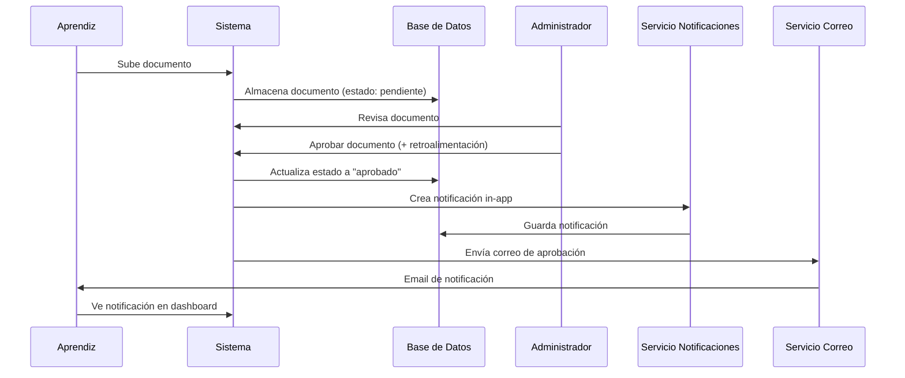
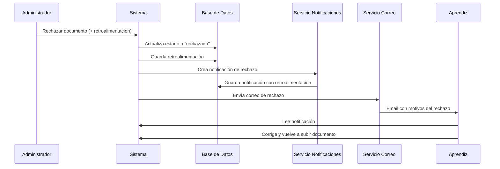
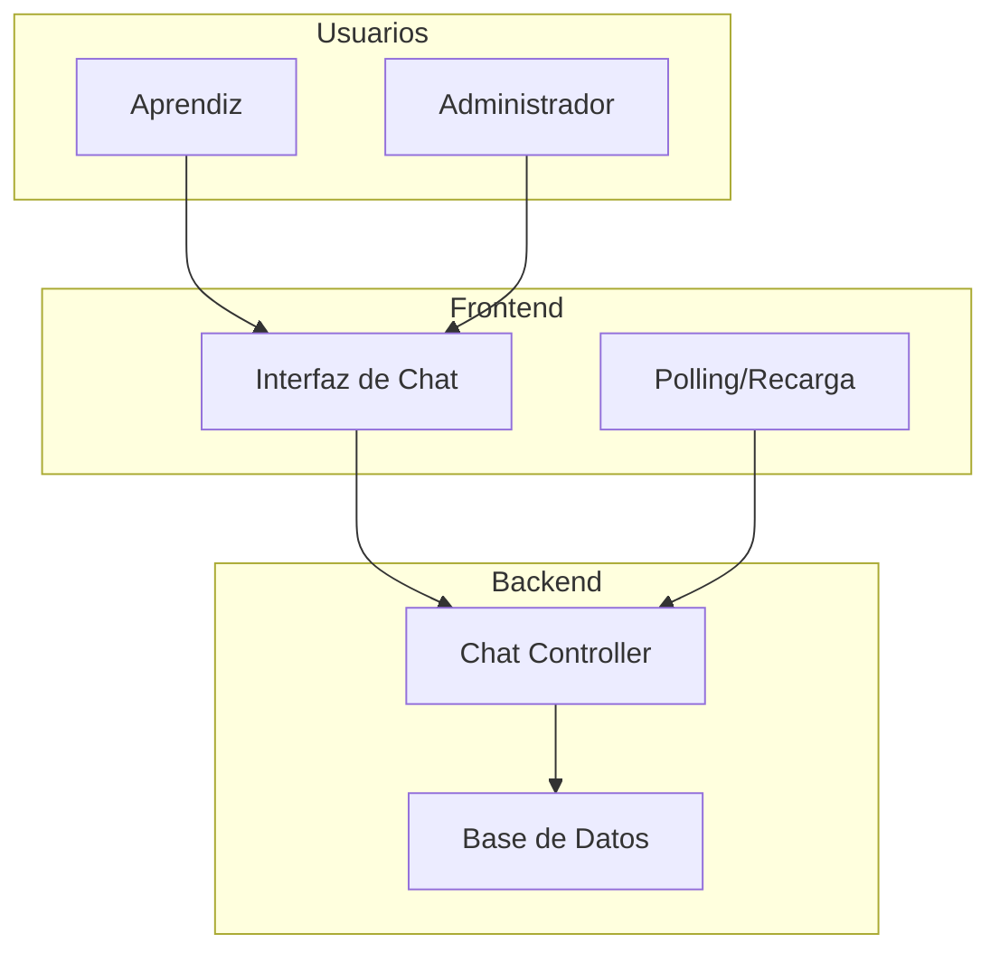

# Documentación Técnica Completa - Gestión Etapa Productiva SENA

## 📖 Índice

- [📋 Información General](#-información-general)
- [🏗️ Arquitectura del Sistema](#️-arquitectura-del-sistema)
  - [Arquitectura General (C4 - Context)](#arquitectura-general-c4---context)
  - [Arquitectura de Componentes (C4 - Components)](#arquitectura-de-componentes-c4---components)
- [📁 Estructura del Proyecto](#-estructura-del-proyecto)
- [🔧 Tecnologías y Dependencias](#-tecnologías-y-dependencias)
  - [Tecnologías Principales](#tecnologías-principales)
  - [Dependencias de Producción](#dependencias-de-producción)
  - [Dependencias de Desarrollo](#dependencias-de-desarrollo)
- [🗄️ Modelo de Datos](#️-modelo-de-datos)
  - [Diagrama Entidad-Relación Actualizado](#diagrama-entidad-relación-actualizado)
  - [Descripción Técnica del Script de Base de Datos](#descripción-técnica-del-script-de-base-de-datos)
- [� Flujos de Usuario Críticos](#-flujos-de-usuario-críticos)
  - [Ciclo de Vida de Bitácora](#ciclo-de-vida-de-bitácora)
  - [Gestión de Documentos](#gestión-de-documentos)
- [�🔔 Sistema de Notificaciones](#-sistema-de-notificaciones)
  - [Arquitectura de Notificaciones](#arquitectura-de-notificaciones)
  - [Funcionalidades Implementadas](#funcionalidades-implementadas)
  - [API de Notificaciones](#api-de-notificaciones)
- [📄 Sistema de Revisión de Documentos](#-sistema-de-revisión-de-documentos)
  - [Flujo de Aprobación](#flujo-de-aprobación)
  - [Flujo de Rechazo](#flujo-de-rechazo)
  - [Notificaciones por Correo](#notificaciones-por-correo)
- [🔐 Seguridad](#-seguridad)
  - [Medidas Implementadas](#medidas-implementadas)
  - [Configuración de Seguridad](#configuración-de-seguridad)
- [🚀 API REST](#-api-rest)
  - [Endpoints Principales](#endpoints-principales)
  - [Formatos de Respuesta](#formatos-de-respuesta)
- [📊 Monitoreo y Métricas](#-monitoreo-y-métricas)
  - [Métricas Recopiladas](#métricas-recopiladas)
  - [Endpoints de Monitoreo](#endpoints-de-monitoreo)
  - [Alertas Automáticas](#alertas-automáticas)
- [🧪 Testing](#-testing)
  - [Estrategia de Testing](#estrategia-de-testing)
  - [Ejecución de Tests](#ejecución-de-tests)
  - [Estructura de Tests](#estructura-de-tests)
- [� Requisitos del Sistema](#-requisitos-del-sistema)
- [🛠️ Guía de Instalación Manual](#️-guía-de-instalación-manual)
- [🔧 Despliegue y DevOps](#-despliegue-y-devops)
  - [Variables de Entorno](#variables-de-entorno)
  - [Docker Compose](#docker-compose)
  - [CI/CD Pipeline](#cicd-pipeline)
- [💾 Políticas de Respaldo y Recuperación](#-políticas-de-respaldo-y-recuperación)
- [📈 Optimización y Rendimiento](#-optimización-y-rendimiento)
  - [Optimizaciones Implementadas](#optimizaciones-implementadas)
  - [Benchmarks de Rendimiento](#benchmarks-de-rendimiento)
- [🔍 Troubleshooting](#-troubleshooting)
  - [Problemas Comunes y Soluciones](#problemas-comunes-y-soluciones)
- [🚀 Roadmap y Mejoras Futuras](#-roadmap-y-mejoras-futuras)
- [� Glosario de Términos](#-glosario-de-términos)
- [�📞 Soporte y Contacto](#-soporte-y-contacto)

---

## 📋 Información General

**Nombre del Proyecto:** Gestión Etapa Productiva SENA
**Versión:** 1.0
**Fecha:** Diciembre 2025
**Última Actualización:** 11 de diciembre de 2025
**Autor:** Juan Camilo Pareja Sánchez
**Institución:** Servicio Nacional de Aprendizaje (SENA)
**Tecnologías:** Node.js, Express.js, MySQL, EJS, IBM Watson, Redis, PM2

## 🏗️ Arquitectura del Sistema

### Arquitectura General (C4 - Context)



### Arquitectura de Componentes (C4 - Components)



## 📁 Estructura del Proyecto

```
gestion-etapa-productiva/
├── 📂 public/                          # Archivos estáticos
│   ├── 📂 estilos/                     # Sistema de estilos modular
│   │   ├── 📂 base/                    # Estilos base (reset, typography, layout)
│   │   ├── 📂 components/              # Componentes reutilizables
│   │   ├── 📂 themes/                  # Temas (SENA theme)
│   │   └── 📂 utilities/               # Utilidades (animations, accessibility)
│   ├── 📂 js/                          # JavaScript del frontend
│   │   ├── 📂 admin/                   # Scripts específicos de admin
│   │   ├── 📂 autenticacion/           # Scripts de autenticación
│   │   ├── 📂 modules/                 # Módulos reutilizables
│   │   └── 📂 utilidades/              # Utilidades frontend
│   ├── 📂 uploads/                     # Archivos subidos dinámicamente
│   └── 📂 imagenes/                    # Recursos estáticos
├── 📂 src/                             # Código fuente backend
│   ├── 📂 configuracion/               # Configuraciones del sistema
│   │   ├── 📄 baseDatos.js             # Pool de conexiones MySQL
│   │   ├── 📄 watsonConfig.js          # Configuración Watson NLU
│   │   ├── 📄 seguridad.js             # Configuración de seguridad
│   │   ├── 📄 cache.js                 # Configuración Redis
│   │   ├── 📄 monitoreo.js             # Sistema de monitoreo
│   │   └── 📄 optimizacionBD.js        # Optimización BD
│   ├── 📂 modulos/                     # Arquitectura modular
│   │   ├── 📂 administrador/           # Módulo administrador
│   │   │   ├── 📂 controladores/       # Lógica de control
│   │   │   ├── 📂 rutas/               # Definición de rutas
│   │   │   └── 📂 servicios/           # Servicios de negocio
│   │   ├── 📂 aprendiz/                # Módulo aprendiz
│   │   │   ├── 📂 controladores/       # Lógica de control
│   │   │   ├── 📂 rutas/               # Definición de rutas
│   │   │   └── 📂 servicios/           # Servicios de negocio
│   │   └── 📂 compartido/              # Funcionalidades compartidas
│   ├── 📂 compartido/                  # Código compartido
│   │   ├── 📂 middlewares/             # Middlewares personalizados
│   │   ├── 📂 servicios/               # Servicios compartidos
│   │   │   ├── 📄 notificacionesService.js  # Sistema de notificaciones (NUEVO)
│   │   │   ├── 📄 servicioCorreo.js    # Servicio de correo mejorado
│   │   │   └── 📄 servicioAlertas.js   # Alertas automáticas
│   │   ├── 📂 utilidades/              # Utilidades generales
│   │   └── 📂 repositorios/            # Patrón Repository
│   ├── 📂 validaciones/                # Validaciones de entrada
│   └── 📄 servidor.js                  # Punto de entrada Express
├── 📂 tests/                           # Tests automatizados
│   ├── 📂 unit/                        # Tests unitarios
│   ├── 📂 integration/                 # Tests de integración
│   └── 📂 e2e/                         # Tests end-to-end
├── 📂 views/                           # Plantillas EJS
│   ├── 📂 administrador/               # Vistas de admin
│   ├── 📂 aprendiz/                    # Vistas de aprendiz
│   ├── 📂 autenticacion/               # Vistas de login/registro
│   └── 📂 plantillas/                  # Layouts y componentes
├── 📂 data/                            # Datos estáticos
├── 📂 scripts/                         # Scripts de utilidad
├── 📂 logs/                            # Logs de aplicación
├── 📂 docs/                            # Documentación
└── 📂 node_modules/                    # Dependencias (ignorado)
```

## 🔧 Tecnologías y Dependencias

### Tecnologías Principales
- **Node.js 18+**: Runtime de JavaScript del lado servidor
- **Express.js 4.18**: Framework web minimalista y flexible
- **MySQL 8.0**: Base de datos relacional para persistencia de datos
- **EJS 3.1**: Motor de plantillas para renderizado del lado servidor
- **IBM Watson NLU**: Servicio de IA para análisis de sentimientos en bitácoras
- **Redis 5.8**: Sistema de cache para optimización de rendimiento
- **PM2**: Gestor de procesos para producción

### Dependencias de Producción
```json
{
  "express": "^4.18.2",
  "mysql2": "^3.6.5",
  "ejs": "^3.1.9",
  "express-ejs-layouts": "^2.5.1",
  "bcrypt": "^6.0.0",
  "express-session": "^1.17.3",
  "multer": "^1.4.5-lts.1",
  "ibm-watson": "^8.0.0",
  "nodemailer": "^6.9.7",
  "helmet": "^8.1.0",
  "compression": "^1.8.0",
  "cors": "^2.8.5",
  "redis": "^5.8.2",
  "winston": "^3.17.0",
  "winston-daily-rotate-file": "^5.0.0",
  "archiver": "^6.0.1",
  "axios": "^1.10.0",
  "compromise": "^14.14.4",
  "joi": "^18.0.1",
  "natural": "^6.12.0",
  "sentiment": "^5.0.2",
  "exceljs": "^4.4.0"
}
```

### Dependencias de Desarrollo
```json
{
  "jest": "^30.1.3",
  "supertest": "^7.1.4",
  "nodemon": "^3.0.2",
  "@types/node": "^24.0.13",
  "eslint": "^9.37.0"
}
```

## 🗄️ Modelo de Datos

### Diagrama Entidad-Relación Actualizado



#### Descripción Técnica del Script de Base de Datos

### Información General del Script
- **Versión:** 1.0
- **Base de Datos:** sena_etapa_productiva
- **Charset:** utf8mb4_unicode_ci (soporte completo para caracteres Unicode)
- **Motor:** InnoDB (transacciones ACID, integridad referencial)
- **Características Avanzadas:** Índices optimizados, triggers, procedimientos almacenados, eventos automáticos

### Arquitectura de Tablas

#### Tablas Principales (Core Business)

##### 1. aprendices
**Propósito:** Almacena información completa de los aprendices del SENA
**Características Técnicas:**
- **Campos principales:** Información personal, académica y laboral
- **Nuevos campos (Dic 2025):** `genero`, `fotoPerfil`, `documentoSoporte`
- **Validaciones:** Constraints de integridad para fechas de formación
- **Índices:** Optimizados para búsquedas por documento, correo, programa, estado
- **Relaciones:** Padre de bitacoras, documentos_aprendiz y mensajes
- **Auditoría:** Trigger automático para cambios de estado

##### 2. bitacoras
**Propósito:** Registra las bitácoras semanales con análisis de sentimientos
**Características Técnicas:**
- **Campos principales:** Respuestas abiertas, análisis Watson NLU, metadatos
- **Campos JSON:** Almacenamiento flexible para emociones, entidades, palabras clave
- **Validaciones:** Constraints para scores de sentimiento (0-1)
- **Índices:** Optimizados para consultas por aprendiz, fecha, sentimiento
- **Integración:** Análisis automático con IBM Watson NLU

##### 3. documentos_aprendiz
**Propósito:** Gestión de archivos subidos por aprendices
**Características Técnicas:**
- **Campos principales:** Metadatos de archivos, rutas de almacenamiento
- **Validaciones:** Tamaño máximo de archivo (10MB), tipos MIME
- **Índices:** Búsqueda por aprendiz, tipo de documento, fecha
- **Seguridad:** Control de acceso por propietario

##### 4. administradores
**Propósito:** Usuarios administrativos del sistema
**Características Técnicas:**
- **Campos principales:** Información de contacto, roles, estado de cuenta
- **Nuevos campos (Dic 2025):** `fichaGrupo` para asignación específica
- **Seguridad:** Sistema de intentos fallidos, bloqueo automático
- **Roles:** Jerarquía admin/super_admin/instructor
- **Auditoría:** Triggers para logging de cambios

##### 5. notificaciones
**Propósito:** Sistema de notificaciones en tiempo real para aprendices
**Características Técnicas:**
- **Campos principales:** tipo, título, mensaje, referencia, retroalimentación, estado de lectura
- **Campos de auditoría:** fecha_creacion, fecha_lectura
- **Índices:** Optimizados para consultas por usuario, estado leído, tipo, fecha
- **Relaciones:** Foreign key con aprendices (CASCADE)
- **Tipos soportados:** documento_aprobado, documento_rechazado, alerta_documento, alerta_bitacora
- **Campos opcionales:** referencia_id, referencia_tipo (para documentos o bitácoras relacionados)
- **Retroalimentación:** Campo text para almacenar comentarios del administrador

##### 6. mensajes
**Propósito:** Sistema de chat en tiempo real entre aprendices y administradores
**Características Técnicas:**
- **Campos principales:** remitente, destinatario, mensaje, estado de lectura
- **Tipos de usuario:** Soporte polimórfico para remitente/destinatario (aprendiz/admin)
- **Índices:** Optimizados para recuperación de historial de conversaciones
- **Funcionalidad:** Soporte para mensajes no leídos y ordenamiento cronológico

##### 7. conversaciones_eliminadas
**Propósito:** Gestión de eliminación unilateral de conversaciones
**Características Técnicas:**
- **Lógica:** Permite que un usuario "elimine" una conversación sin afectar al otro participante
- **Restricción:** Unique key para evitar duplicados por par de usuarios
- **Privacidad:** Garantiza que el historial eliminado no sea visible para el usuario que lo borró

#### Tablas de Soporte (System)

##### 8. reset_tokens
**Propósito:** Gestión segura de tokens para reset de contraseñas
**Características Técnicas:**
- **Seguridad:** Tokens únicos con expiración automática
- **Auditoría:** Registro de IP y user agent
- **Limpieza:** Evento automático diario para tokens expirados

##### 9. sessions
**Propósito:** Almacenamiento de sesiones de usuario (MySQL store)
**Características Técnicas:**
- **Persistencia:** Sesiones sobrevivientes a reinicios de servidor
- **Limpieza:** Evento automático por hora
- **Auditoría:** Tracking de IP y user agent

##### 10. logs_acceso
**Propósito:** Auditoría completa de accesos y acciones del sistema
**Características Técnicas:**
- **Campos JSON:** Detalles flexibles de eventos
- **Índices:** Búsqueda eficiente por usuario, acción, fecha
- **Retención:** Histórico completo de actividades

##### 11. configuracion_sistema
**Propósito:** Configuración dinámica del sistema
**Características Técnicas:**
- **Flexibilidad:** Valores de diferentes tipos (string, number, boolean, json)
- **Categorización:** Agrupación lógica de configuraciones
- **Edición:** Control de qué configuraciones son editables desde UI

### Procedimientos Almacenados

#### sp_limpiar_tokens_expirados()
**Función:** Mantenimiento automático de tokens expirados
**Ejecución:** Automática diaria vía evento
**Beneficio:** Prevención de acumulación de datos obsoletos

#### sp_limpiar_sesiones_expiradas()
**Función:** Limpieza de sesiones expiradas
**Ejecución:** Automática cada hora
**Beneficio:** Optimización de espacio y rendimiento

#### sp_estadisticas_sentimientos(fecha_inicio, fecha_fin)
**Función:** Análisis estadístico de sentimientos en bitácoras
**Parámetros:** Rango de fechas para análisis
**Retorno:** Conteos y porcentajes por tipo de sentimiento

#### sp_cumplimiento_documentos()
**Función:** Evaluación del cumplimiento en subida de documentos
**Lógica:** Cálculo dinámico basado en tiempo transcurrido en etapa productiva
**Categorías:** Excelente (≥90%), Bueno (80-89%), Regular (60-79%), Deficiente (<60%)

#### sp_cumplimiento_seguimiento()
**Función:** Medición del cumplimiento en registro de bitácoras
**Lógica:** Frecuencia quincenal esperada durante etapa productiva
**Beneficio:** Identificación temprana de aprendices con bajo seguimiento

### Vistas Optimizadas

#### v_estadisticas_aprendices
**Función:** Estadísticas generales de aprendices por estado
**Campos:** Totales y desgloses por estado de formación (activo, inactivo, aplazado, retirado, certificado)
**Uso:** Dashboards administrativos, reportes generales
**Actualización:** Incluye nuevo estado 'certificado' (Nov 2025)

#### v_resumen_bitacoras
**Función:** Resumen consolidado de bitácoras por aprendiz
**Campos:** Conteos por sentimiento, promedios, última actividad
**Uso:** Seguimiento individual de aprendices, análisis de tendencias

#### v_documentos_pendientes_revision (NUEVO - Nov 2025)
**Función:** Listado de documentos que requieren revisión por administradores
**Campos:** ID documento, información del aprendiz, tipo de documento, fecha de subida, estado
**Filtros:** Estado pendiente, documentos activos
**Uso:** Dashboard administrativo, módulo de revisión de documentos, reportes de documentos pendientes
**Beneficio:** Optimización de consultas para el flujo de revisión de documentos

### Eventos Automáticos

#### ev_limpiar_tokens_expirados
- **Frecuencia:** Diaria
- **Acción:** Ejecución de sp_limpiar_tokens_expirados()
- **Beneficio:** Mantenimiento automático sin intervención manual

#### ev_limpiar_sesiones_expiradas
- **Frecuencia:** Cada hora
- **Acción:** Ejecución de sp_limpiar_sesiones_expiradas()
- **Beneficio:** Prevención de crecimiento innecesario de tabla sessions

### Triggers de Auditoría

#### tr_aprendices_after_update
**Tabla:** aprendices
**Evento:** AFTER UPDATE
**Función:** Logging automático de cambios de estado de formación
**Beneficio:** Trazabilidad completa de cambios administrativos

#### tr_administradores_after_update
**Tabla:** administradores
**Evento:** AFTER UPDATE
**Función:** Auditoría de cambios en cuentas administrativas
**Beneficio:** Seguridad y compliance en gestión de usuarios admin

### Configuraciones Iniciales

El script incluye configuraciones por defecto para:
- **Seguridad:** Máximo intentos login, tiempo bloqueo
- **Archivos:** Tamaño máximo, tipos permitidos
- **IA:** Umbral confianza Watson NLU
- **Sistema:** Notificaciones, modo mantenimiento

### Optimizaciones de Rendimiento

- **Índices Estratégicos:** Cubren patrones de consulta más frecuentes
- **Constraints Eficientes:** Validaciones a nivel BD reducen lógica aplicación
- **Motor InnoDB:** Soporte transaccional para integridad de datos
- **Charset UTF8MB4:** Compatibilidad completa con caracteres especiales
- **Partitioning Preparado:** Estructura lista para particionamiento futuro si es necesario

### Consideraciones de Escalabilidad

- **Normalización:** Estructura 3FN evita redundancia
- **Flexibilidad JSON:** Campos extensibles sin cambios de esquema
- **Eventos Automáticos:** Mantenimiento proactivo
- **Auditoría Integral:** Logging sin impactar rendimiento principal
- **Configuración Dinámica:** Adaptabilidad sin redeploys

## � Flujos de Usuario Críticos

### Ciclo de Vida de Bitácora
1. **Registro**: El aprendiz ingresa el contenido de la bitácora quincenal.
2. **Análisis IA**: Watson NLU procesa el texto en tiempo real para detectar sentimientos y entidades.
3. **Persistencia**: Se guarda la bitácora con los metadatos del análisis.
4. **Notificación**: El sistema alerta al instructor si hay sentimientos negativos o riesgos.
5. **Revisión**: El instructor visualiza la bitácora y el análisis.
6. **Retroalimentación**: El instructor agrega comentarios y calificación.

### Gestión de Documentos
1. **Carga**: Aprendiz sube documento (PDF/Img).
2. **Validación**: Sistema verifica tipo MIME y tamaño.
3. **Almacenamiento**: Archivo se guarda en sistema de archivos/nube.
4. **Cola de Revisión**: Documento aparece en dashboard de administrador.
5. **Decisión**: Administrador aprueba o rechaza con feedback.
6. **Notificación**: Aprendiz recibe alerta en tiempo real y correo.

## �🔔 Sistema de Notificaciones

### Arquitectura de Notificaciones

El sistema de notificaciones implementado en noviembre 2025 proporciona comunicación en tiempo real entre el sistema y los aprendices, mejorando significativamente la experiencia de usuario y el engagement.



### Funcionalidades Implementadas

#### 1. Creación de Notificaciones
```javascript
// Parámetros de notificación
{
  usuarioId: number,        // ID del aprendiz
  tipo: string,             // Tipo de notificación
  titulo: string,           // Título breve
  mensaje: string,          // Mensaje detallado
  referenciaId: number,     // ID relacionado (opcional)
  referenciaTipo: string,   // Tipo de referencia (opcional)
  retroalimentacion: text   // Feedback del admin (opcional)
}
```

**Tipos de notificaciones soportados:**
- `documento_aprobado`: Documento aprobado por administrador
- `documento_rechazado`: Documento rechazado con retroalimentación
- `alerta_documento`: Recordatorio de documento pendiente
- `alerta_bitacora`: Recordatorio de bitácora quincenal

#### 2. Gestión de Notificaciones

**Operaciones disponibles:**
- ✅ Crear notificación
- ✅ Obtener notificaciones (todas o solo no leídas)
- ✅ Contar notificaciones no leídas
- ✅ Marcar como leída (individual)
- ✅ Marcar todas como leídas
- ✅ Eliminar notificación individual
- ✅ Eliminar todas las notificaciones leídas

#### 3. Interfaz de Usuario

**Badge Visual Animado:**
- Contador de notificaciones no leídas
- Animación "rebote" al recibir nuevas notificaciones
- Actualización en tiempo real

**Modal de Notificaciones:**
- Diseño responsivo (móvil y escritorio)
- Cards diferenciadas por tipo de notificación
- Iconos contextuales (✅ aprobado, ❌ rechazado, ⚠️ alerta)
- Soporte para modo oscuro
- Acciones rápidas (marcar leída, eliminar)

**Características de Accesibilidad:**
- ARIA labels para lectores de pantalla
- Contraste de colores optimizado
- Navegación por teclado completa

### API de Notificaciones

#### Endpoints Implementados

```javascript
// Contador de notificaciones no leídas
GET /aprendiz/notificaciones/contador
Response: { count: number }

// Listar notificaciones del aprendiz
GET /aprendiz/notificaciones?soloNoLeidas=true|false
Response: {
  success: true,
  notificaciones: [
    {
      id: number,
      tipo: string,
      titulo: string,
      mensaje: string,
      leida: boolean,
      fecha_creacion: datetime,
      referencia_id: number,
      referencia_tipo: string,
      retroalimentacion: text
    }
  ]
}

// Marcar todas las notificaciones como leídas
POST /aprendiz/notificaciones/marcar-todas-leidas
Response: { success: true, updated: number }

// Eliminar todas las notificaciones leídas
DELETE /aprendiz/notificaciones/eliminar-leidas
Response: { success: true, deleted: number }

// Marcar notificación individual como leída
POST /aprendiz/notificaciones/:id/marcar-leida
Response: { success: true }

// Eliminar notificación individual
DELETE /aprendiz/notificaciones/:id
Response: { success: true }
```

### Integración con Otros Sistemas

#### Con Sistema de Revisión de Documentos
Cuando un administrador aprueba o rechaza un documento:
1. Se actualiza el estado del documento
2. Se crea automáticamente una notificación in-app
3. Opcionalmente se envía correo electrónico
4. El badge se actualiza en tiempo real

#### Con Sistema de Alertas
Las alertas automáticas (documentos pendientes, bitácoras) ahora:
1. Se generan como notificaciones persistentes
2. Quedan registradas en base de datos
3. Son rastreables y auditables
4. Pueden ser marcadas como leídas/eliminadas por el usuario

### Beneficios del Sistema

- ✅ **Mejor comunicación:** Feedback instantáneo sobre documentos
- ✅ **Mayor engagement:** Recordatorios persistentes y visibles
- ✅ **Trazabilidad:** Historial completo de notificaciones
- ✅ **Reducción de emails:** Menos dependencia del correo electrónico
- ✅ **UX mejorada:** Interfaz intuitiva y moderna
- ✅ **Accesibilidad:** Cumplimiento de estándares WCAG

## 📄 Sistema de Revisión de Documentos

### Flujo de Aprobación

El sistema de revisión de documentos implementado permite a los administradores aprobar documentos con retroalimentación opcional y notificación automática al aprendiz.



#### Endpoint de Aprobación

```javascript
POST /administrador/documentos/:id/aprobar

Body: {
  retroalimentacion: string (opcional),
  enviarEmail: boolean (opcional, default: true)
}

Response: {
  success: true,
  message: "Documento aprobado exitosamente",
  notificacionCreada: true,
  correoEnviado: true
}
```

**Proceso interno:**
1. Verificar existencia del documento
2. Obtener información del aprendiz
3. Actualizar estado del documento a "aprobado"
4. Registrar retroalimentación (si existe)
5. Crear notificación in-app
6. Enviar correo electrónico (si está habilitado)
7. Detectar si es re-aprobación (documento previamente rechazado)

### Flujo de Rechazo



#### Endpoint de Rechazo

```javascript
POST /administrador/documentos/:id/rechazar

Body: {
  retroalimentacion: string (OBLIGATORIO),
  enviarEmail: boolean (opcional, default: true)
}

Response: {
  success: true,
  message: "Documento rechazado",
  notificacionCreada: true,
  correoEnviado: true
}
```

**Proceso interno:**
1. Validar retroalimentación obligatoria
2. Verificar existencia del documento
3. Obtener información del aprendiz
4. Actualizar estado del documento a "rechazado"
5. Registrar retroalimentación
6. Crear notificación in-app con retroalimentación
7. Enviar correo electrónico con motivos del rechazo
8. Detectar si es re-rechazo

### Notificaciones por Correo

#### Template de Aprobación

**Características:**
- ✅ Diseño HTML responsive
- ✅ Logo institucional del SENA
- ✅ Colores corporativos
- ✅ Información clara del documento aprobado
- ✅ Retroalimentación del administrador (si existe)
- ✅ Detección de re-aprobación
- ✅ Versión plain text alternativa

**Estructura del correo:**
```
Asunto: ✅ Documento aprobado: [Tipo de Documento]

Contenido:
- Saludo personalizado
- Mensaje de aprobación
- Tipo de documento aprobado
- Retroalimentación del tutor (opcional)
- Mensaje motivacional
- Firma institucional
```

#### Template de Rechazo

**Características:**
- ⚠️ Diseño HTML responsive
- ⚠️ Iconografía de advertencia
- ⚠️ Retroalimentación destacada
- ⚠️ Instrucciones claras para corrección
- ⚠️ Detección de re-rechazo
- ⚠️ Tono constructivo y educativo

**Estructura del correo:**
```
Asunto: ❌ Documento rechazado: [Tipo de Documento]

Contenido:
- Saludo personalizado
- Mensaje de rechazo constructivo
- Tipo de documento rechazado
- Retroalimentación DETALLADA del tutor
- Instrucciones para corrección
- Mensaje de apoyo
- Firma institucional
```

### Estados de Documentos

El sistema maneja tres estados principales:

1. **pendiente**: Documento subido, esperando revisión
2. **aprobado**: Documento aprobado por administrador
3. **rechazado**: Documento rechazado, requiere corrección

**Transiciones permitidas:**
- pendiente → aprobado
- pendiente → rechazado
- rechazado → aprobado (re-aprobación)
- aprobado → rechazado (re-rechazo, caso excepcional)

### Tipos de Documentos Obligatorios

**Lista actualizada (18 tipos - Nov 2025):**

1. Bitácora 1 a 12 (12 documentos)
2. Propuesta de intervención
3. Diagnóstico
4. GFPI-F-023 V5
5. Informe final
6. **Carta de certificación** (NUEVO)
7. **Documento de identidad** (NUEVO)

### Vista de Verificación de Documentación

**Archivo:** `views/administrador/verificarDocumentacion.ejs`

**Mejoras implementadas:**
- Interfaz moderna y responsive
- Filtros por tipo de documento y estado
- Búsqueda rápida por aprendiz
- Vista previa de documentos
- Formularios modales para aprobar/rechazar
- Historial de revisiones
- Estadísticas de cumplimiento
- Exportación de reportes

## � Sistema de Chat

### Arquitectura del Chat

El sistema de chat implementado en diciembre 2025 permite la comunicación directa y asíncrona entre aprendices y administradores, facilitando el soporte y la resolución de dudas.



### Funcionalidades Implementadas

#### 1. Mensajería Bidireccional
- **Comunicación:** Aprendiz ↔ Administrador
- **Historial:** Persistencia completa de conversaciones
- **Estado:** Indicadores de mensajes leídos/no leídos
- **Ordenamiento:** Cronológico inverso para lista de conversaciones

#### 2. Gestión de Conversaciones
- **Listado:** Vista de todas las conversaciones activas
- **Búsqueda:** Filtrado por nombre de usuario
- **Contadores:** Badge de mensajes no leídos por conversación

#### 3. Eliminación de Conversaciones
- **Tipo:** Eliminación unilateral (Soft Delete lógico por usuario)
- **Privacidad:** Si un usuario elimina la conversación, desaparece de su vista pero se mantiene para la contraparte
- **Seguridad:** Confirmación requerida antes de eliminar

### API de Chat

#### Endpoints Principales

```javascript
// Enviar mensaje
POST /chat/enviar
Body: { destinatarioId, mensaje }

// Obtener historial de conversación
GET /chat/historial/:usuarioId

// Listar conversaciones
GET /chat/conversaciones

// Marcar mensajes como leídos
POST /chat/marcar-leidos
Body: { remitenteId }

// Eliminar conversación
DELETE /chat/conversacion/:usuarioId
```

## �🔐 Seguridad

### Medidas Implementadas

#### Autenticación y Autorización
- **Hashing de contraseñas**: bcrypt con salt rounds = 10
- **Sesiones seguras**: express-session con MySQL store
- **Validación de roles**: Middleware de autorización por rol
- **Timeouts de sesión**: Configurable por entorno

#### Validación de Entrada
- **express-validator**: Validación server-side completa
- **Sanitización**: Eliminación de caracteres peligrosos
- **Límites de tamaño**: Control de longitud de inputs
- **Validación de tipos MIME**: Para archivos subidos

#### Headers de Seguridad
- **Helmet.js**: Configuración completa de headers de seguridad
- **CORS**: Configuración restrictiva de orígenes permitidos
- **HSTS**: HTTP Strict Transport Security
- **CSP**: Content Security Policy

#### Protección contra Ataques Comunes
- **Rate Limiting**: express-rate-limit por rutas
- **SQL Injection**: Prepared statements con mysql2
- **XSS**: Sanitización y CSP
- **CSRF**: Tokens de validación (preparado para implementación)

### Configuración de Seguridad

```javascript
// src/configuracion/seguridad.js
const helmetConfig = {
    contentSecurityPolicy: {
        directives: {
            defaultSrc: ["'self'"],
            styleSrc: ["'self'", "'unsafe-inline'", "https://fonts.googleapis.com"],
            scriptSrc: ["'self'", "'unsafe-inline'", "https://code.jquery.com"],
            imgSrc: ["'self'", "data:", "https:"],
            connectSrc: ["'self'", "https://api.watson.cloud.ibm.com"],
            objectSrc: ["'none'"],
            upgradeInsecureRequests: [],
        },
    },
    hsts: { maxAge: 31536000, includeSubDomains: true, preload: true },
    noSniff: true,
    xssFilter: true,
    referrerPolicy: { policy: "strict-origin-when-cross-origin" },
    frameguard: { action: 'deny' }
};
```

## 🚀 API REST

### Endpoints Principales

#### Autenticación
```
POST   /auth/login              - Inicio de sesión
POST   /auth/logout             - Cierre de sesión
POST   /auth/reset-password     - Reset de contraseña
POST   /crear-password          - Creación de contraseña inicial
```

#### Administrador
```
GET    /administrador/dashboard - Panel principal
GET    /administrador/aprendices - Listado de aprendices
POST   /administrador/aprendices - Crear aprendiz
PUT    /administrador/aprendices/:id - Actualizar aprendiz
DELETE /administrador/aprendices/:id - Eliminar aprendiz
GET    /administrador/bitacoras/:id - Ver bitácoras de aprendiz
GET    /administrador/reportes   - Reportes y estadísticas

# Revisión de Documentos (NUEVO - Nov 2025)
POST   /administrador/documentos/:id/aprobar - Aprobar documento
POST   /administrador/documentos/:id/rechazar - Rechazar documento

# Exportación de Reportes (NUEVO - Nov 2025)
GET    /administrador/reportes/exportar/programas - Exportar programas a Excel
GET    /administrador/reportes/exportar/estados - Exportar estados a Excel
GET    /administrador/reportes/exportar/alternativas - Exportar alternativas a Excel
GET    /administrador/reportes/exportar/documentos - Exportar cumplimiento documentos a Excel
GET    /administrador/reportes/exportar/seguimiento - Exportar seguimiento a Excel
GET    /administrador/reportes/exportar/completo - Exportar reporte completo a Excel
```

#### Aprendiz
```
GET    /aprendiz/dashboard      - Dashboard del aprendiz
POST   /aprendiz/bitacora       - Registrar bitácora
GET    /aprendiz/documentos     - Gestionar documentos
POST   /aprendiz/documentos     - Subir documento

# Notificaciones (NUEVO - Nov 2025)
GET    /aprendiz/notificaciones/contador - Contador de no leídas
GET    /aprendiz/notificaciones - Listar notificaciones
POST   /aprendiz/notificaciones/marcar-todas-leidas - Marcar todas como leídas
DELETE /aprendiz/notificaciones/eliminar-leidas - Eliminar notificaciones leídas
POST   /aprendiz/notificaciones/:id/marcar-leida - Marcar individual como leída
DELETE /aprendiz/notificaciones/:id - Eliminar notificación
```

### Formatos de Respuesta

#### Respuesta Exitosa
```json
{
  "success": true,
  "data": { ... },
  "message": "Operación exitosa"
}
```

#### Respuesta de Error
```json
{
  "success": false,
  "error": "Descripción del error",
  "details": [ ... ]
}
```

#### Respuesta de Datos Tabulares (DataTables)
```json
{
  "draw": 1,
  "recordsTotal": 100,
  "recordsFiltered": 50,
  "data": [ ... ]
}
```

## 📊 Monitoreo y Métricas

### Métricas Recopiladas

#### Rendimiento de Aplicación
- **Requests totales**: Contador de requests HTTP
- **Tiempo de respuesta**: Promedio y percentiles
- **Tasa de error**: Porcentaje de responses 4xx/5xx
- **Uso de memoria**: Heap usage y picos
- **Uso de CPU**: Load average del sistema

#### Base de Datos
- **Conexiones activas**: Número de conexiones abiertas
- **Consultas ejecutadas**: Contador total
- **Consultas lentas**: Queries > 1 segundo
- **Tiempo promedio de consultas**: En milisegundos

#### Sistema
- **Uptime**: Tiempo de ejecución
- **Memoria libre**: RAM disponible
- **CPU usage**: Porcentaje de uso

### Endpoints de Monitoreo

```
GET    /health     - Health check básico
GET    /metrics    - Métricas detalladas (requiere auth)
```

### Alertas Automáticas

#### Alertas de Sistema
- **Memoria alta**: > 500MB heap usage
- **CPU alta**: Load average > 2.0
- **Tasa de error**: > 5% de requests
- **Conexiones BD**: > 20 conexiones activas
- **Memoria sistema**: < 100MB libre

#### Alertas de Aprendices (Nov 2025)
- **Frecuencia de envío**: Cada 6 días (optimizado desde 7 días)
- **Bitácoras pendientes**: Recordatorio quincenal (cada 15 días)
- **Documentos obligatorios**: 18 tipos de documentos monitoreados
  - Bitácora 1 a 12
  - Propuesta de intervención
  - Diagnóstico
  - GFPI-F-023 V5
  - Informe final
  - Carta de certificación (NUEVO)
  - Documento de identidad (NUEVO)
- **Canal de entrega**: Notificaciones in-app + correo electrónico opcional
- **Persistencia**: Almacenadas en tabla `notificaciones` para trazabilidad

## 🧪 Testing

### Estrategia de Testing

#### Unit Tests
- **Cobertura**: Mínimo 80% de líneas
- **Herramientas**: Jest + Supertest
- **Mocks**: Base de datos y servicios externos

#### Integration Tests
- **API endpoints**: Validación completa de flujos
- **Base de datos**: Operaciones CRUD
- **Autenticación**: Flujos completos de login/logout
- **Cobertura Actual**: 39 tests de integración implementados
- **Módulos Probados**: Autenticación, Documentos, Bitácoras

#### E2E Tests (Futuro)
- **User journeys**: Flujos completos de usuario
- **Performance**: Tests de carga

### Ejecución de Tests

```bash
# Tests unitarios
npm test

# Tests con cobertura
npm run test:coverage

# Tests de integración
npm run test:integration

# Tests de performance
npm run test:performance
```

### Estructura de Tests

```
tests/
├── unit/
│   ├── servicios/
│   ├── utilidades/
│   └── validaciones/
├── integration/
│   ├── api/
│   └── database/
├── e2e/
│   ├── user-journeys/
│   └── performance/
└── setup.js
```

## � Requisitos del Sistema

### Hardware Recomendado (Servidor)
- **Procesador**: 2 vCPU o superior (2.0 GHz+)
- **Memoria RAM**: 4 GB mínimo (8 GB recomendado para producción)
- **Almacenamiento**: 20 GB SSD disponibles
- **Red**: Conexión estable con IP estática pública

### Software Base
- **Sistema Operativo**: Ubuntu Server 20.04/22.04 LTS, CentOS 8+, o Windows Server 2019+
- **Runtime**: Node.js v18.17.0 (LTS) o superior
- **Base de Datos**: MySQL Community Server 8.0+
- **Cache**: Redis 6.0+
- **Gestor de Procesos**: PM2 (última versión estable)

## 🛠️ Guía de Instalación Manual

### 1. Preparación del Entorno
```bash
# Actualizar sistema
sudo apt update && sudo apt upgrade -y

# Instalar Node.js
curl -fsSL https://deb.nodesource.com/setup_18.x | sudo -E bash -
sudo apt-get install -y nodejs

# Instalar Redis
sudo apt install redis-server
```

### 2. Configuración de la Aplicación
```bash
# Clonar repositorio
git clone https://github.com/JuanCamiloParejaSanchez/gestion_etapa_productiva.git
cd gestion_etapa_productiva

# Instalar dependencias
npm install --production

# Configurar variables de entorno
cp .env.example .env
nano .env # Editar con credenciales reales
```

### 3. Base de Datos
```bash
# Importar esquema
mysql -u root -p < MySQL.sql
```

### 4. Ejecución
```bash
# Iniciar con PM2
npm install -g pm2
pm2 start ecosystem.config.js --env production
pm2 save
pm2 startup
```

## �🔧 Despliegue y DevOps

### Variables de Entorno

```bash
# Base de datos
DB_HOST=localhost
DB_PORT=3306
DB_USER=gestion_user
DB_PASSWORD=secure_password
DB_NAME=gestion_etapa_productiva

# Sesiones
SESSION_SECRET=very_secure_random_string
SESSION_NAME=gestion_session

# Watson NLU
WATSON_API_KEY=your_watson_api_key
WATSON_URL=https://api.us-south.natural-language-understanding.watson.cloud.ibm.com
WATSON_VERSION=2021-08-01

# Correo
SMTP_HOST=smtp.gmail.com
SMTP_PORT=587
SMTP_USER=your_email@gmail.com
SMTP_PASS=your_app_password

# Seguridad
NODE_ENV=production
JWT_SECRET=another_secure_random_string
RATE_LIMIT_WINDOW=900000
RATE_LIMIT_MAX=100

# Monitoreo
LOG_LEVEL=info
METRICS_ENABLED=true
```

### Docker Compose

```yaml
version: '3.8'
services:
  app:
    build: .
    ports:
      - "3000:3000"
    environment:
      - NODE_ENV=production
    depends_on:
      - mysql
      - redis
    volumes:
      - ./logs:/app/logs
      - ./uploads:/app/public/uploads

  mysql:
    image: mysql:8.0
    environment:
      MYSQL_ROOT_PASSWORD: rootpassword
      MYSQL_DATABASE: gestion_etapa_productiva
      MYSQL_USER: gestion_user
      MYSQL_PASSWORD: secure_password
    volumes:
      - mysql_data:/var/lib/mysql
      - ./MySQL.sql:/docker-entrypoint-initdb.d/init.sql

  redis:
    image: redis:7-alpine
    volumes:
      - redis_data:/data

volumes:
  mysql_data:
  redis_data:
```

### CI/CD Pipeline

```yaml
# .github/workflows/deploy.yml
name: Deploy to Production

on:
  push:
    branches: [ main ]

jobs:
  test:
    runs-on: ubuntu-latest
    steps:
      - uses: actions/checkout@v3
      - uses: actions/setup-node@v3
        with:
          node-version: '18'
      - run: npm ci
      - run: npm test
      - run: npm run test:security

  build-and-deploy:
    needs: test
    runs-on: ubuntu-latest
    steps:
      - uses: actions/checkout@v3
      - name: Build and push Docker image
        run: |
          docker build -t gestion-sena:latest .
          docker tag gestion-sena:latest ghcr.io/${{ github.repository }}/gestion-sena:latest
          docker push ghcr.io/${{ github.repository }}/gestion-sena:latest
```

## � Políticas de Respaldo y Recuperación

### Base de Datos
- **Frecuencia**: Diaria (00:00 hrs)
- **Herramienta**: `mysqldump` automatizado con cron job
- **Retención**: 30 días rotativos
- **Almacenamiento**: S3 Bucket o servidor externo seguro

### Archivos de Usuario (Uploads)
- **Estrategia**: Sincronización incremental diaria
- **Directorios**: `public/uploads/documentos`, `public/uploads/fotos`
- **Recuperación**: Restauración granular por archivo o masiva por fecha

### Plan de Recuperación ante Desastres (DRP)
1. Provisionar nuevo servidor con requisitos base.
2. Restaurar último dump de MySQL.
3. Restaurar carpeta `uploads` desde backup.
4. Desplegar código fuente desde repositorio (tag de versión estable).
5. Restaurar archivo `.env` desde gestor de secretos.

## �📈 Optimización y Rendimiento

### Optimizaciones Implementadas

#### Base de Datos
- **Connection pooling**: mysql2 con pool de conexiones configurables
- **Prepared statements**: Prevención de SQL injection
- **Índices optimizados**: Para consultas frecuentes (correo, documento, programa, etc.)
- **Query caching**: Cache inteligente de resultados con Redis
- **Transacciones**: Para operaciones críticas y consistencia de datos

#### Aplicación
- **Compression**: gzip para responses HTTP
- **Caching**: Headers de cache apropiados + Redis para datos
- **Lazy loading**: Para recursos pesados
- **Minificación**: CSS y JS en producción
- **Sistema de Monitoreo**: Métricas en tiempo real con alertas automáticas

#### Servicios Externos
- **Redis Cache**: Aceleración de consultas frecuentes
- **IBM Watson NLU**: Análisis de sentimientos en bitácoras
- **Sistema de Logging**: Winston con rotación diaria
- **Gestión de Procesos**: PM2 para producción

#### Arquitectura
- **Modular**: Separación clara por responsabilidades
- **Middleware**: Autenticación, validación, seguridad
- **Pool de Conexiones**: Optimización de recursos BD
- **Sistema de Archivos**: Gestión segura de uploads

### Benchmarks de Rendimiento

#### Tiempos de Respuesta (P95)
- **Dashboard**: < 500ms
- **Listado de aprendices**: < 800ms
- **Registro de bitácora**: < 300ms
- **Análisis Watson**: < 2000ms

#### Throughput
- **Requests/segundo**: 50-100 (dependiendo de la operación)
- **Conexiones concurrentes**: 100+
- **Memoria por request**: ~2-5MB

## 🔍 Troubleshooting

### Problemas Comunes y Soluciones

#### Error de Conexión a BD
```bash
# Verificar variables de entorno
echo $DB_HOST $DB_PORT $DB_USER

# Probar conexión manual
mysql -h $DB_HOST -P $DB_PORT -u $DB_USER -p

# Verificar logs
tail -f logs/error.log
```

#### Watson NLU no responde
```bash
# Verificar configuración
curl -X GET "$WATSON_URL/v1/analyze?version=$WATSON_VERSION&text=test" \
  -H "Authorization: Bearer $WATSON_API_KEY"

# Verificar logs de Watson
grep "Watson" logs/combined.log
```

#### Memoria Insuficiente
```bash
# Monitorear uso de memoria
node --max-old-space-size=1024 server.js

# Verificar métricas
curl http://localhost:3000/metrics

# Ajustar límites de PM2
pm2 reload ecosystem.config.js
```

#### Alta Latencia
```bash
# Verificar consultas lentas
mysql -e "SELECT * FROM performance_schema.events_statements_summary_by_digest WHERE avg_timer_wait > 1000000000 ORDER BY avg_timer_wait DESC LIMIT 10;"

# Revisar índices
mysql -e "SHOW INDEX FROM aprendices;"

# Verificar logs de aplicación
grep "lento\|slow" logs/combined.log
```

## 🚀 Roadmap y Mejoras Futuras

### Fase 1 (Q4 2025): Optimización ✅ COMPLETADO
- [x] Implementar Redis para caching
- [x] Sistema de notificaciones en tiempo real
- [x] Sistema de revisión de documentos con retroalimentación
- [x] Exportación de reportes a Excel con biblioteca XLSX
- [x] Modo oscuro completo en UI
- [x] Estado 'certificado' para aprendices
- [x] Alertas optimizadas (frecuencia 6 días)
- [ ] Migrar a TypeScript
- [ ] Agregar tests E2E con Playwright
- [ ] Implementar API versioning

### Fase 2 (Q1 2026): Escalabilidad
- [ ] Arquitectura de microservicios
- [ ] Container orchestration con Kubernetes
- [ ] CDN para assets estáticos
- [ ] Database sharding
- [ ] WebSockets para notificaciones en tiempo real

### Fase 3 (Q2 2026): IA y Analytics
- [ ] Dashboard avanzado con Power BI
- [ ] Recomendaciones automáticas con ML
- [ ] Análisis predictivo de deserción
- [ ] Chatbot de soporte
- [ ] Análisis de sentimientos mejorado con modelos propios

### Fase 4 (Q3 2026): Modernización
- [ ] Migración a React/Vue.js
- [ ] API GraphQL
- [ ] Serverless functions
- [ ] PWA (Progressive Web App)
- [ ] Aplicación móvil nativa

## � Glosario de Términos

- **Aprendiz**: Estudiante del SENA en proceso de formación.
- **Etapa Productiva**: Fase práctica donde el aprendiz aplica conocimientos en una empresa.
- **Bitácora**: Registro periódico (quincenal) de actividades y experiencias del aprendiz.
- **Ficha**: Código único que identifica al grupo de formación del aprendiz.
- **Instructor de Seguimiento**: Docente encargado de monitorear el progreso del aprendiz.
- **Watson NLU**: Servicio de IBM para análisis de lenguaje natural usado para evaluar sentimientos.

## �📞 Soporte y Contacto

### Equipo de Desarrollo
- **Líder Técnico**: Juan Camilo Pareja Sánchez
- **Email**: camilo_pareja@hotmail.com
