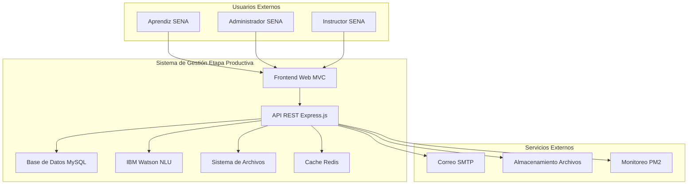
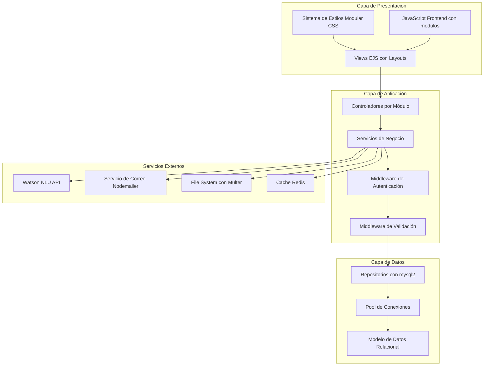

# Documentación Técnica Completa Unificada - Gestión Etapa Productiva SENA

## 📖 Índice

- [ Información General](#-información-general)
- [🏗️ Arquitectura del Sistema](#️-arquitectura-del-sistema)
  - [Arquitectura General (C4 - Context)](#arquitectura-general-c4---context)
  - [Arquitectura de Componentes (C4 - Components)](#arquitectura-de-componentes-c4---components)
- [📁 Estructura del Proyecto](#-estructura-del-proyecto)
- [🔧 Tecnologías y Dependencias](#-tecnologías-y-dependencias)
  - [Tecnologías Principales](#tecnologías-principales)
  - [Dependencias de Producción](#dependencias-de-producción)
  - [Dependencias de Desarrollo](#dependencias-de-desarrollo)
- [🗄️ Modelo de Datos](#️-modelo-de-datos)
  - [Diagrama Entidad-Relación Actualizado](#diagrama-entidad-relación-actualizado)
  - [Descripción Técnica del Script de Base de Datos](#descripción-técnica-del-script-de-base-de-datos)
- [🔐 Seguridad](#-seguridad)
  - [Medidas Implementadas](#medidas-implementadas)
  - [Configuración de Seguridad](#configuración-de-seguridad)
- [🚀 API REST](#-api-rest)
  - [Endpoints Principales](#endpoints-principales)
  - [Formatos de Respuesta](#formatos-de-respuesta)
- [📊 Monitoreo y Métricas](#-monitoreo-y-métricas)
  - [Métricas Recopiladas](#métricas-recopiladas)
  - [Endpoints de Monitoreo](#endpoints-de-monitoreo)
  - [Alertas Automáticas](#alertas-automáticas)
- [🧪 Testing](#-testing)
  - [Estrategia de Testing](#estrategia-de-testing)
  - [Ejecución de Tests](#ejecución-de-tests)
  - [Estructura de Tests](#estructura-de-tests)
- [🔧 Despliegue y DevOps](#-despliegue-y-devops)
  - [Variables de Entorno](#variables-de-entorno)
  - [Docker Compose](#docker-compose)
  - [CI/CD Pipeline](#cicd-pipeline)
- [📈 Optimización y Rendimiento](#-optimización-y-rendimiento)
  - [Optimizaciones Implementadas](#optimizaciones-implementadas)
  - [Benchmarks de Rendimiento](#benchmarks-de-rendimiento)
- [🔍 Troubleshooting](#-troubleshooting)
  - [Problemas Comunes y Soluciones](#problemas-comunes-y-soluciones)
- [🚀 Roadmap y Mejoras Futuras](#-roadmap-y-mejoras-futuras)
- [📞 Soporte y Contacto](#-soporte-y-contacto)

---

## 📋 Información General

**Nombre del Proyecto:** Gestión Etapa Productiva SENA
**Versión:** 1.0.0
**Fecha:** Octubre 2025 (Unificada)
**Autor:** Juan Camilo Pareja Sánchez
**Institución:** Servicio Nacional de Aprendizaje (SENA)
**Tecnologías:** Node.js, Express.js, MySQL, EJS, IBM Watson, Redis, PM2

## 🏗️ Arquitectura del Sistema

### Arquitectura General (C4 - Context)



### Arquitectura de Componentes (C4 - Components)



## 📁 Estructura del Proyecto

```
gestion-etapa-productiva/
├── 📂 public/                          # Archivos estáticos
│   ├── 📂 estilos/                     # Sistema de estilos modular
│   │   ├── 📂 base/                    # Estilos base (reset, typography, layout)
│   │   ├── 📂 components/              # Componentes reutilizables
│   │   ├── 📂 themes/                  # Temas (SENA theme)
│   │   └── 📂 utilities/               # Utilidades (animations, accessibility)
│   ├── 📂 js/                          # JavaScript del frontend
│   │   ├── 📂 admin/                   # Scripts específicos de admin
│   │   ├── 📂 autenticacion/           # Scripts de autenticación
│   │   ├── 📂 modules/                 # Módulos reutilizables
│   │   └── 📂 utilidades/              # Utilidades frontend
│   ├── 📂 uploads/                     # Archivos subidos dinámicamente
│   └── 📂 imagenes/                    # Recursos estáticos
├── 📂 src/                             # Código fuente backend
│   ├── 📂 configuracion/               # Configuraciones del sistema
│   │   ├── 📄 baseDatos.js             # Pool de conexiones MySQL
│   │   ├── 📄 watsonConfig.js          # Configuración Watson NLU
│   │   ├── 📄 seguridad.js             # Configuración de seguridad
│   │   ├── 📄 cache.js                 # Configuración Redis
│   │   ├── 📄 monitoreo.js             # Sistema de monitoreo
│   │   └── 📄 optimizacionBD.js        # Optimización BD
│   ├── 📂 modulos/                     # Arquitectura modular
│   │   ├── 📂 administrador/           # Módulo administrador
│   │   │   ├── 📂 controladores/       # Lógica de control
│   │   │   ├── 📂 rutas/               # Definición de rutas
│   │   │   └── 📂 servicios/           # Servicios de negocio
│   │   ├── 📂 aprendiz/                # Módulo aprendiz
│   │   │   ├── 📂 controladores/       # Lógica de control
│   │   │   ├── 📂 rutas/               # Definición de rutas
│   │   │   └── 📂 servicios/           # Servicios de negocio
│   │   └── 📂 compartido/              # Funcionalidades compartidas
│   ├── 📂 compartido/                  # Código compartido
│   │   ├── 📂 middlewares/             # Middlewares personalizados
│   │   ├── 📂 servicios/               # Servicios compartidos
│   │   ├── 📂 utilidades/              # Utilidades generales
│   │   └── 📂 repositorios/            # Patrón Repository
│   ├── 📂 validaciones/                # Validaciones de entrada
│   └── 📄 servidor.js                  # Punto de entrada Express
├── 📂 tests/                           # Tests automatizados
│   ├── 📂 unit/                        # Tests unitarios
│   ├── 📂 integration/                 # Tests de integración
│   └── 📂 e2e/                         # Tests end-to-end
├── 📂 views/                           # Plantillas EJS
│   ├── 📂 administrador/               # Vistas de admin
│   ├── 📂 aprendiz/                    # Vistas de aprendiz
│   ├── 📂 autenticacion/               # Vistas de login/registro
│   └── 📂 plantillas/                  # Layouts y componentes
├── 📂 data/                            # Datos estáticos
├── 📂 scripts/                         # Scripts de utilidad
├── 📂 logs/                            # Logs de aplicación
├── 📂 docs/                            # Documentación
└── 📂 node_modules/                    # Dependencias (ignorado)
```

## 🔧 Tecnologías y Dependencias

### Tecnologías Principales
- **Node.js 18+**: Runtime de JavaScript del lado servidor
- **Express.js 4.18**: Framework web minimalista y flexible
- **MySQL 8.0**: Base de datos relacional para persistencia de datos
- **EJS 3.1**: Motor de plantillas para renderizado del lado servidor
- **IBM Watson NLU**: Servicio de IA para análisis de sentimientos en bitácoras
- **Redis 5.8**: Sistema de cache para optimización de rendimiento
- **PM2**: Gestor de procesos para producción

### Dependencias de Producción
```json
{
  "express": "^4.18.2",
  "mysql2": "^3.6.5",
  "ejs": "^3.1.9",
  "express-ejs-layouts": "^2.5.1",
  "bcrypt": "^6.0.0",
  "express-session": "^1.17.3",
  "multer": "^1.4.5-lts.1",
  "ibm-watson": "^8.0.0",
  "nodemailer": "^6.9.7",
  "helmet": "^8.1.0",
  "compression": "^1.8.0",
  "cors": "^2.8.5",
  "redis": "^5.8.2",
  "winston": "^3.17.0",
  "winston-daily-rotate-file": "^5.0.0"
}
```

### Dependencias de Desarrollo
```json
{
  "jest": "^30.1.3",
  "supertest": "^7.1.4",
  "nodemon": "^3.0.2",
  "@types/node": "^24.0.13",
  "eslint": "^9.37.0"
}
```

## 🗄️ Modelo de Datos

### Diagrama Entidad-Relación Actualizado

```mermaid
erDiagram
    aprendices ||--o{ bitacoras : registra
    aprendices ||--o{ documentos_aprendiz : sube
    administradores ||--o{ aprendices : gestiona
    aprendices {
        int id PK
        varchar tipoDocumento
        varchar numeroDocumento UK
        varchar estadoFormacion
        varchar nombres
        varchar primerApellido
        varchar segundoApellido
        date fechaNacimiento
        varchar eps
        varchar telefonoFijo
        varchar celular
        varchar direccion
        varchar barrio
        varchar departamento
        varchar municipio
        varchar correoElectronico UK
        date fechaInicioFormacion
        date fechaInicioLectiva
        date fechaFinLectiva
        date fechaInicioProductiva
        date fechaFinProductiva
        varchar instructorLectiva
        varchar instructorProductiva
        varchar numeroFicha
        varchar programaFormacion
        varchar alternativaSeleccionada
        varchar areaFormacion
        varchar empresaPatrocinadora
        varchar areaPractica
        varchar jefeInmediato
        varchar telefonoEmpresa
        varchar celularEmpresa
        varchar direccionEmpresa
        varchar correoEmpresa
        varchar horario
        varchar password
        varchar rol
        tinyint activo
        datetime fechaRegistro
        datetime fechaUltimoCorreoAlerta
    }
    bitacoras {
        int id PK
        int aprendizId FK
        datetime fechaRegistro
        text contenido
        varchar estado
        datetime fechaAprobacion
        text comentariosInstructor
        text sentimiento_desafio
        text sentimiento_logro
        text sentimiento_comunicacion
        decimal score_desafio
        decimal score_logro
        decimal score_comunicacion
        text sentimiento_general
        decimal score_promedio
        decimal confianza
        boolean contiene_ironia
        json contextos_detectados
        json recomendaciones
        datetime created_at
        datetime updated_at
    }
    documentos_aprendiz {
        int id PK
        int aprendiz_id FK
        varchar tipo_documento
        varchar descripcion
        varchar nombre_original
        varchar nombre_guardado
        datetime fecha_subida
        bigint tamano_bytes
        varchar tipo_mime
        tinyint activo
        datetime created_at
    }
    administradores {
        int id PK
        varchar nombreCompleto
        varchar correoInstitucional UK
        varchar numeroIdentificacion UK
        varchar telefono
        varchar departamento
        varchar cargo
        varchar password
        varchar rol
        tinyint activo
        datetime fechaRegistro
    }
```



#### Descripción Técnica del Script de Base de Datos

### Información General del Script
- **Versión:** 2.0
- **Base de Datos:** sena_etapa_productiva
- **Charset:** utf8mb4_unicode_ci (soporte completo para caracteres Unicode)
- **Motor:** InnoDB (transacciones ACID, integridad referencial)
- **Características Avanzadas:** Índices optimizados, triggers, procedimientos almacenados, eventos automáticos

### Arquitectura de Tablas

#### Tablas Principales (Core Business)

##### 1. aprendices
**Propósito:** Almacena información completa de los aprendices del SENA
**Características Técnicas:**
- **Campos principales:** Información personal, académica y laboral
- **Validaciones:** Constraints de integridad para fechas de formación
- **Índices:** Optimizados para búsquedas por documento, correo, programa, estado
- **Relaciones:** Padre de bitacoras y documentos_aprendiz
- **Auditoría:** Trigger automático para cambios de estado

##### 2. bitacoras
**Propósito:** Registra las bitácoras semanales con análisis de sentimientos
**Características Técnicas:**
- **Campos principales:** Respuestas abiertas, análisis Watson NLU, metadatos
- **Campos JSON:** Almacenamiento flexible para emociones, entidades, palabras clave
- **Validaciones:** Constraints para scores de sentimiento (0-1)
- **Índices:** Optimizados para consultas por aprendiz, fecha, sentimiento
- **Integración:** Análisis automático con IBM Watson NLU

##### 3. documentos_aprendiz
**Propósito:** Gestión de archivos subidos por aprendices
**Características Técnicas:**
- **Campos principales:** Metadatos de archivos, rutas de almacenamiento
- **Validaciones:** Tamaño máximo de archivo (10MB), tipos MIME
- **Índices:** Búsqueda por aprendiz, tipo de documento, fecha
- **Seguridad:** Control de acceso por propietario

##### 4. administradores
**Propósito:** Usuarios administrativos del sistema
**Características Técnicas:**
- **Campos principales:** Información de contacto, roles, estado de cuenta
- **Seguridad:** Sistema de intentos fallidos, bloqueo automático
- **Roles:** Jerarquía admin/super_admin/instructor
- **Auditoría:** Triggers para logging de cambios

#### Tablas de Soporte (System)

##### 5. reset_tokens
**Propósito:** Gestión segura de tokens para reset de contraseñas
**Características Técnicas:**
- **Seguridad:** Tokens únicos con expiración automática
- **Auditoría:** Registro de IP y user agent
- **Limpieza:** Evento automático diario para tokens expirados

##### 6. sessions
**Propósito:** Almacenamiento de sesiones de usuario (MySQL store)
**Características Técnicas:**
- **Persistencia:** Sesiones sobrevivientes a reinicios de servidor
- **Limpieza:** Evento automático por hora
- **Auditoría:** Tracking de IP y user agent

##### 7. logs_acceso
**Propósito:** Auditoría completa de accesos y acciones del sistema
**Características Técnicas:**
- **Campos JSON:** Detalles flexibles de eventos
- **Índices:** Búsqueda eficiente por usuario, acción, fecha
- **Retención:** Histórico completo de actividades

##### 8. configuracion_sistema
**Propósito:** Configuración dinámica del sistema
**Características Técnicas:**
- **Flexibilidad:** Valores de diferentes tipos (string, number, boolean, json)
- **Categorización:** Agrupación lógica de configuraciones
- **Edición:** Control de qué configuraciones son editables desde UI

### Procedimientos Almacenados

#### sp_limpiar_tokens_expirados()
**Función:** Mantenimiento automático de tokens expirados
**Ejecución:** Automática diaria vía evento
**Beneficio:** Prevención de acumulación de datos obsoletos

#### sp_limpiar_sesiones_expiradas()
**Función:** Limpieza de sesiones expiradas
**Ejecución:** Automática cada hora
**Beneficio:** Optimización de espacio y rendimiento

#### sp_estadisticas_sentimientos(fecha_inicio, fecha_fin)
**Función:** Análisis estadístico de sentimientos en bitácoras
**Parámetros:** Rango de fechas para análisis
**Retorno:** Conteos y porcentajes por tipo de sentimiento

#### sp_cumplimiento_documentos()
**Función:** Evaluación del cumplimiento en subida de documentos
**Lógica:** Cálculo dinámico basado en tiempo transcurrido en etapa productiva
**Categorías:** Excelente (≥90%), Bueno (80-89%), Regular (60-79%), Deficiente (<60%)

#### sp_cumplimiento_seguimiento()
**Función:** Medición del cumplimiento en registro de bitácoras
**Lógica:** Frecuencia quincenal esperada durante etapa productiva
**Beneficio:** Identificación temprana de aprendices con bajo seguimiento

### Vistas Optimizadas

#### v_estadisticas_aprendices
**Función:** Estadísticas generales de aprendices por estado
**Campos:** Totales y desgloses por estado de formación
**Uso:** Dashboards administrativos, reportes generales

#### v_resumen_bitacoras
**Función:** Resumen consolidado de bitácoras por aprendiz
**Campos:** Conteos por sentimiento, promedios, última actividad
**Uso:** Seguimiento individual de aprendices, análisis de tendencias

### Eventos Automáticos

#### ev_limpiar_tokens_expirados
- **Frecuencia:** Diaria
- **Acción:** Ejecución de sp_limpiar_tokens_expirados()
- **Beneficio:** Mantenimiento automático sin intervención manual

#### ev_limpiar_sesiones_expiradas
- **Frecuencia:** Cada hora
- **Acción:** Ejecución de sp_limpiar_sesiones_expiradas()
- **Beneficio:** Prevención de crecimiento innecesario de tabla sessions

### Triggers de Auditoría

#### tr_aprendices_after_update
**Tabla:** aprendices
**Evento:** AFTER UPDATE
**Función:** Logging automático de cambios de estado de formación
**Beneficio:** Trazabilidad completa de cambios administrativos

#### tr_administradores_after_update
**Tabla:** administradores
**Evento:** AFTER UPDATE
**Función:** Auditoría de cambios en cuentas administrativas
**Beneficio:** Seguridad y compliance en gestión de usuarios admin

### Configuraciones Iniciales

El script incluye configuraciones por defecto para:
- **Seguridad:** Máximo intentos login, tiempo bloqueo
- **Archivos:** Tamaño máximo, tipos permitidos
- **IA:** Umbral confianza Watson NLU
- **Sistema:** Notificaciones, modo mantenimiento

### Optimizaciones de Rendimiento

- **Índices Estratégicos:** Cubren patrones de consulta más frecuentes
- **Constraints Eficientes:** Validaciones a nivel BD reducen lógica aplicación
- **Motor InnoDB:** Soporte transaccional para integridad de datos
- **Charset UTF8MB4:** Compatibilidad completa con caracteres especiales
- **Partitioning Preparado:** Estructura lista para particionamiento futuro si es necesario

### Consideraciones de Escalabilidad

- **Normalización:** Estructura 3FN evita redundancia
- **Flexibilidad JSON:** Campos extensibles sin cambios de esquema
- **Eventos Automáticos:** Mantenimiento proactivo
- **Auditoría Integral:** Logging sin impactar rendimiento principal
- **Configuración Dinámica:** Adaptabilidad sin redeploys

## 🔐 Seguridad

### Medidas Implementadas

#### Autenticación y Autorización
- **Hashing de contraseñas**: bcrypt con salt rounds = 10
- **Sesiones seguras**: express-session con MySQL store
- **Validación de roles**: Middleware de autorización por rol
- **Timeouts de sesión**: Configurable por entorno

#### Validación de Entrada
- **express-validator**: Validación server-side completa
- **Sanitización**: Eliminación de caracteres peligrosos
- **Límites de tamaño**: Control de longitud de inputs
- **Validación de tipos MIME**: Para archivos subidos

#### Headers de Seguridad
- **Helmet.js**: Configuración completa de headers de seguridad
- **CORS**: Configuración restrictiva de orígenes permitidos
- **HSTS**: HTTP Strict Transport Security
- **CSP**: Content Security Policy

#### Protección contra Ataques Comunes
- **Rate Limiting**: express-rate-limit por rutas
- **SQL Injection**: Prepared statements con mysql2
- **XSS**: Sanitización y CSP
- **CSRF**: Tokens de validación (preparado para implementación)

### Configuración de Seguridad

```javascript
// src/configuracion/seguridad.js
const helmetConfig = {
    contentSecurityPolicy: {
        directives: {
            defaultSrc: ["'self'"],
            styleSrc: ["'self'", "'unsafe-inline'", "https://fonts.googleapis.com"],
            scriptSrc: ["'self'", "'unsafe-inline'", "https://code.jquery.com"],
            imgSrc: ["'self'", "data:", "https:"],
            connectSrc: ["'self'", "https://api.watson.cloud.ibm.com"],
            objectSrc: ["'none'"],
            upgradeInsecureRequests: [],
        },
    },
    hsts: { maxAge: 31536000, includeSubDomains: true, preload: true },
    noSniff: true,
    xssFilter: true,
    referrerPolicy: { policy: "strict-origin-when-cross-origin" },
    frameguard: { action: 'deny' }
};
```

## 🚀 API REST

### Endpoints Principales

#### Autenticación
```
POST   /auth/login              - Inicio de sesión
POST   /auth/logout             - Cierre de sesión
POST   /auth/reset-password     - Reset de contraseña
POST   /crear-password          - Creación de contraseña inicial
```

#### Administrador
```
GET    /administrador/dashboard - Panel principal
GET    /administrador/aprendices - Listado de aprendices
POST   /administrador/aprendices - Crear aprendiz
PUT    /administrador/aprendices/:id - Actualizar aprendiz
DELETE /administrador/aprendices/:id - Eliminar aprendiz
GET    /administrador/bitacoras/:id - Ver bitácoras de aprendiz
GET    /administrador/reportes   - Reportes y estadísticas
```

#### Aprendiz
```
GET    /aprendiz/dashboard      - Dashboard del aprendiz
POST   /aprendiz/bitacora       - Registrar bitácora
GET    /aprendiz/documentos     - Gestionar documentos
POST   /aprendiz/documentos     - Subir documento
```

### Formatos de Respuesta

#### Respuesta Exitosa
```json
{
  "success": true,
  "data": { ... },
  "message": "Operación exitosa"
}
```

#### Respuesta de Error
```json
{
  "success": false,
  "error": "Descripción del error",
  "details": [ ... ]
}
```

#### Respuesta de Datos Tabulares (DataTables)
```json
{
  "draw": 1,
  "recordsTotal": 100,
  "recordsFiltered": 50,
  "data": [ ... ]
}
```

## 📊 Monitoreo y Métricas

### Métricas Recopiladas

#### Rendimiento de Aplicación
- **Requests totales**: Contador de requests HTTP
- **Tiempo de respuesta**: Promedio y percentiles
- **Tasa de error**: Porcentaje de responses 4xx/5xx
- **Uso de memoria**: Heap usage y picos
- **Uso de CPU**: Load average del sistema

#### Base de Datos
- **Conexiones activas**: Número de conexiones abiertas
- **Consultas ejecutadas**: Contador total
- **Consultas lentas**: Queries > 1 segundo
- **Tiempo promedio de consultas**: En milisegundos

#### Sistema
- **Uptime**: Tiempo de ejecución
- **Memoria libre**: RAM disponible
- **CPU usage**: Porcentaje de uso

### Endpoints de Monitoreo

```
GET    /health     - Health check básico
GET    /metrics    - Métricas detalladas (requiere auth)
```

### Alertas Automáticas

- **Memoria alta**: > 500MB heap usage
- **CPU alta**: Load average > 2.0
- **Tasa de error**: > 5% de requests
- **Conexiones BD**: > 20 conexiones activas
- **Memoria sistema**: < 100MB libre

## 🧪 Testing

### Estrategia de Testing

#### Unit Tests
- **Cobertura**: Mínimo 80% de líneas
- **Herramientas**: Jest + Supertest
- **Mocks**: Base de datos y servicios externos

#### Integration Tests
- **API endpoints**: Validación completa de flujos
- **Base de datos**: Operaciones CRUD
- **Autenticación**: Flujos completos de login/logout
- **Cobertura Actual**: 39 tests de integración implementados
- **Módulos Probados**: Autenticación, Documentos, Bitácoras

#### E2E Tests (Futuro)
- **User journeys**: Flujos completos de usuario
- **Performance**: Tests de carga

### Ejecución de Tests

```bash
# Tests unitarios
npm test

# Tests con cobertura
npm run test:coverage

# Tests de integración
npm run test:integration

# Tests de performance
npm run test:performance
```

### Estructura de Tests

```
tests/
├── unit/
│   ├── servicios/
│   ├── utilidades/
│   └── validaciones/
├── integration/
│   ├── api/
│   └── database/
├── e2e/
│   ├── user-journeys/
│   └── performance/
└── setup.js
```

## 🔧 Despliegue y DevOps

### Variables de Entorno

```bash
# Base de datos
DB_HOST=localhost
DB_PORT=3306
DB_USER=gestion_user
DB_PASSWORD=secure_password
DB_NAME=gestion_etapa_productiva

# Sesiones
SESSION_SECRET=very_secure_random_string
SESSION_NAME=gestion_session

# Watson NLU
WATSON_API_KEY=your_watson_api_key
WATSON_URL=https://api.us-south.natural-language-understanding.watson.cloud.ibm.com
WATSON_VERSION=2021-08-01

# Correo
SMTP_HOST=smtp.gmail.com
SMTP_PORT=587
SMTP_USER=your_email@gmail.com
SMTP_PASS=your_app_password

# Seguridad
NODE_ENV=production
JWT_SECRET=another_secure_random_string
RATE_LIMIT_WINDOW=900000
RATE_LIMIT_MAX=100

# Monitoreo
LOG_LEVEL=info
METRICS_ENABLED=true
```

### Docker Compose

```yaml
version: '3.8'
services:
  app:
    build: .
    ports:
      - "3000:3000"
    environment:
      - NODE_ENV=production
    depends_on:
      - mysql
      - redis
    volumes:
      - ./logs:/app/logs
      - ./uploads:/app/public/uploads

  mysql:
    image: mysql:8.0
    environment:
      MYSQL_ROOT_PASSWORD: rootpassword
      MYSQL_DATABASE: gestion_etapa_productiva
      MYSQL_USER: gestion_user
      MYSQL_PASSWORD: secure_password
    volumes:
      - mysql_data:/var/lib/mysql
      - ./MySQL.sql:/docker-entrypoint-initdb.d/init.sql

  redis:
    image: redis:7-alpine
    volumes:
      - redis_data:/data

volumes:
  mysql_data:
  redis_data:
```

### CI/CD Pipeline

```yaml
# .github/workflows/deploy.yml
name: Deploy to Production

on:
  push:
    branches: [ main ]

jobs:
  test:
    runs-on: ubuntu-latest
    steps:
      - uses: actions/checkout@v3
      - uses: actions/setup-node@v3
        with:
          node-version: '18'
      - run: npm ci
      - run: npm test
      - run: npm run test:security

  build-and-deploy:
    needs: test
    runs-on: ubuntu-latest
    steps:
      - uses: actions/checkout@v3
      - name: Build and push Docker image
        run: |
          docker build -t gestion-sena:latest .
          docker tag gestion-sena:latest ghcr.io/${{ github.repository }}/gestion-sena:latest
          docker push ghcr.io/${{ github.repository }}/gestion-sena:latest
```

## 📈 Optimización y Rendimiento

### Optimizaciones Implementadas

#### Base de Datos
- **Connection pooling**: mysql2 con pool de conexiones configurables
- **Prepared statements**: Prevención de SQL injection
- **Índices optimizados**: Para consultas frecuentes (correo, documento, programa, etc.)
- **Query caching**: Cache inteligente de resultados con Redis
- **Transacciones**: Para operaciones críticas y consistencia de datos

#### Aplicación
- **Compression**: gzip para responses HTTP
- **Caching**: Headers de cache apropiados + Redis para datos
- **Lazy loading**: Para recursos pesados
- **Minificación**: CSS y JS en producción
- **Sistema de Monitoreo**: Métricas en tiempo real con alertas automáticas

#### Servicios Externos
- **Redis Cache**: Aceleración de consultas frecuentes
- **IBM Watson NLU**: Análisis de sentimientos en bitácoras
- **Sistema de Logging**: Winston con rotación diaria
- **Gestión de Procesos**: PM2 para producción

#### Arquitectura
- **Modular**: Separación clara por responsabilidades
- **Middleware**: Autenticación, validación, seguridad
- **Pool de Conexiones**: Optimización de recursos BD
- **Sistema de Archivos**: Gestión segura de uploads

### Benchmarks de Rendimiento

#### Tiempos de Respuesta (P95)
- **Dashboard**: < 500ms
- **Listado de aprendices**: < 800ms
- **Registro de bitácora**: < 300ms
- **Análisis Watson**: < 2000ms

#### Throughput
- **Requests/segundo**: 50-100 (dependiendo de la operación)
- **Conexiones concurrentes**: 100+
- **Memoria por request**: ~2-5MB

## 🔍 Troubleshooting

### Problemas Comunes y Soluciones

#### Error de Conexión a BD
```bash
# Verificar variables de entorno
echo $DB_HOST $DB_PORT $DB_USER

# Probar conexión manual
mysql -h $DB_HOST -P $DB_PORT -u $DB_USER -p

# Verificar logs
tail -f logs/error.log
```

#### Watson NLU no responde
```bash
# Verificar configuración
curl -X GET "$WATSON_URL/v1/analyze?version=$WATSON_VERSION&text=test" \
  -H "Authorization: Bearer $WATSON_API_KEY"

# Verificar logs de Watson
grep "Watson" logs/combined.log
```

#### Memoria Insuficiente
```bash
# Monitorear uso de memoria
node --max-old-space-size=1024 server.js

# Verificar métricas
curl http://localhost:3000/metrics

# Ajustar límites de PM2
pm2 reload ecosystem.config.js
```

#### Alta Latencia
```bash
# Verificar consultas lentas
mysql -e "SELECT * FROM performance_schema.events_statements_summary_by_digest WHERE avg_timer_wait > 1000000000 ORDER BY avg_timer_wait DESC LIMIT 10;"

# Revisar índices
mysql -e "SHOW INDEX FROM aprendices;"

# Verificar logs de aplicación
grep "lento\|slow" logs/combined.log
```

## 🚀 Roadmap y Mejoras Futuras

### Fase 1 (Q1 2025): Optimización ✅ IMPLEMENTADO
- [x] Implementar Redis para caching
- [ ] Migrar a TypeScript
- [ ] Agregar tests E2E con Playwright
- [ ] Implementar API versioning

### Fase 2 (Q2 2025): Escalabilidad
- [ ] Arquitectura de microservicios
- [ ] Container orchestration con Kubernetes
- [ ] CDN para assets estáticos
- [ ] Database sharding

### Fase 3 (Q3 2025): IA y Analytics
- [ ] Dashboard avanzado con Power BI
- [ ] Recomendaciones automáticas con ML
- [ ] Análisis predictivo de deserción
- [ ] Chatbot de soporte

### Fase 4 (Q4 2025): Modernización
- [ ] Migración a React/Vue.js
- [ ] API GraphQL
- [ ] Serverless functions
- [ ] PWA (Progressive Web App)

## 📞 Soporte y Contacto

### Equipo de Desarrollo
- **Líder Técnico**: Juan Camilo Pareja Sánchez
- **Email**: juan.pareja@sena.edu.co
- **Repositorio**: https://github.com/juanpareja/gestion-etapa-productiva

### Documentación Adicional
- [Manual de Usuario](./Manual%20de%20usuario.pdf)
- [Documentación Técnica](./Documentacion%20Tecnica.pdf)
- [Guía de Instalación](./README.md)

### Canales de Soporte
- **Issues**: GitHub Issues
- **Wiki**: Documentación interna
- **Slack**: Canal #gestion-etapa-productiva

---

**Última actualización**: Octubre 2025
**Versión de documentación**: 2.0.0