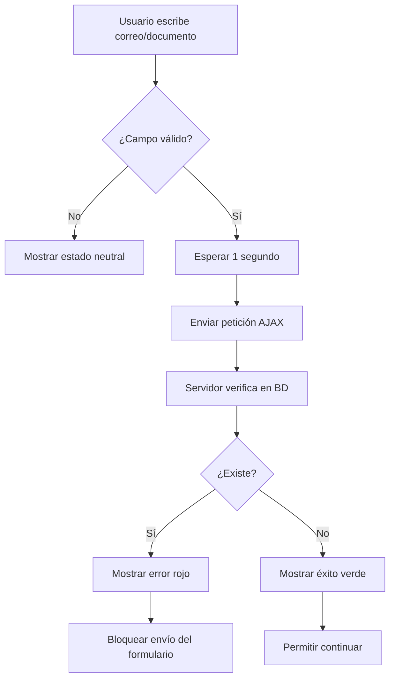

# 🎉 MEJORAS IMPLEMENTADAS: Validación de Duplicados en Registro de Aprendices

## ✅ **Funcionalidades Agregadas**

### 🔍 **1. Validación de Duplicados en Tiempo Real**
- **Correo Electrónico**: Verifica si ya existe un aprendiz con el mismo correo
- **Número de Documento**: Verifica si ya existe un aprendiz con el mismo documento
- **Validación Automática**: Se ejecuta automáticamente después de 1 segundo de escribir
- **Retroalimentación Visual**: 
  - ✅ Verde = Disponible
  - ❌ Rojo = Ya existe
  - 🔄 Spinner de carga durante la verificación

### 🎨 **2. Mejoras en la Interfaz de Usuario**
- **Estilos Bootstrap**: Indicadores visuales claros para campos válidos/inválidos
- **Iconos FontAwesome**: Indicadores visuales atractivos
- **Mensajes de Error**: Alertas informativas y descriptivas
- **Estados de Carga**: Spinner durante el procesamiento del formulario

### 🛠️ **3. Mejoras en el Backend**
- **Nueva Ruta**: `/verificar-duplicado` para validaciones AJAX
- **Manejo de Errores**: Específico para errores de duplicación (ER_DUP_ENTRY)
- **Servicio de Consultas**: Nueva función `buscarPorNumeroDocumento`
- **Códigos de Error**: Identificación específica de errores de duplicación

## 📁 **Archivos Modificados**

### 🎯 **Frontend**
1. **`views/aprendiz/registroInicial.ejs`**
   - Agregada validación en tiempo real
   - Interceptación del envío del formulario
   - Estilos CSS personalizados
   - Manejo de estados de carga

### 🚀 **Backend**
2. **`src/modulos/aprendiz/controladores/controladorRegistroAprendiz.js`**
   - Mejorado manejo de errores de duplicación
   - Nueva función `verificarDuplicado`
   - Mensajes específicos según el tipo de duplicación

3. **`src/modulos/aprendiz/servicios/servicioConsultasAprendiz.js`**
   - Nueva función `buscarPorNumeroDocumento`

4. **`src/modulos/aprendiz/rutas/rutasRegistroAprendiz.js`**
   - Nueva ruta POST `/verificar-duplicado`

## 🧪 **Herramientas de Prueba Creadas**

### 📄 **Archivos de Prueba**
1. **`test_validacion_duplicados.html`** - Interfaz web para probar duplicados
2. **`test_flujo_registro.html`** - Guía completa del flujo de registro
3. **`test_validacion_duplicados.js`** - Scripts para consola del navegador

## 🔄 **Flujo de Validación**

## 🎯 **Beneficios Implementados**

### 👤 **Para el Usuario**
- ✅ **Retroalimentación Inmediata**: Sabe al instante si sus datos están disponibles
- ✅ **Prevención de Errores**: No puede enviar formularios con datos duplicados
- ✅ **Experiencia Fluida**: Validación sin interrumpir el flujo de escritura
- ✅ **Mensajes Claros**: Información específica sobre qué datos están duplicados

### 👨‍💻 **Para el Sistema**
- ✅ **Reducción de Errores**: Menos intentos fallidos de registro
- ✅ **Mejor UX**: Interfaz más profesional y moderna
- ✅ **Manejo Robusto**: Gestión específica de errores de duplicación
- ✅ **Escalabilidad**: Sistema fácil de extender a otros campos

## 🚀 **Cómo Probar**

### 🌐 **Prueba en el Navegador**
1. Ir a: `http://localhost:3000/registrar-aprendiz`
2. Escribir en los campos "Correo" o "Número de documento"
3. Salir del campo (hacer clic fuera)
4. Observar la validación en tiempo real

### 🧪 **Página de Pruebas Dedicada**
1. Abrir: `test_validacion_duplicados.html`
2. Probar diferentes correos y documentos
3. Ver resultados inmediatos

## 🎉 **Resultado Final**
El formulario de registro ahora proporciona una experiencia de usuario moderna y profesional, con validación inteligente que previene errores antes de que ocurran, mejorando significativamente la usabilidad del sistema SENA.

---
**Desarrollado por:** GitHub Copilot  
**Fecha:** Agosto 2025  
**Estado:** ✅ Completamente funcional
